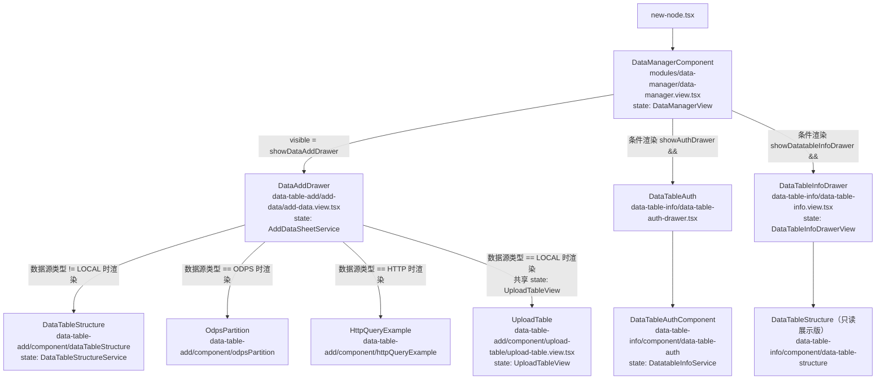
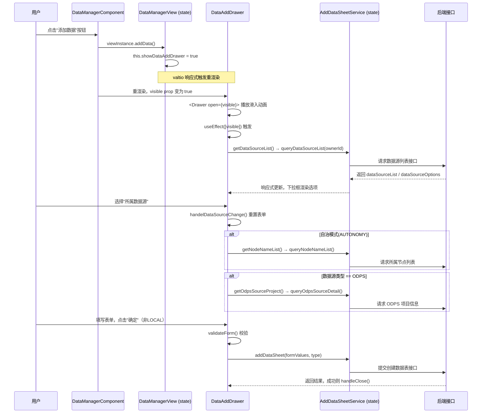
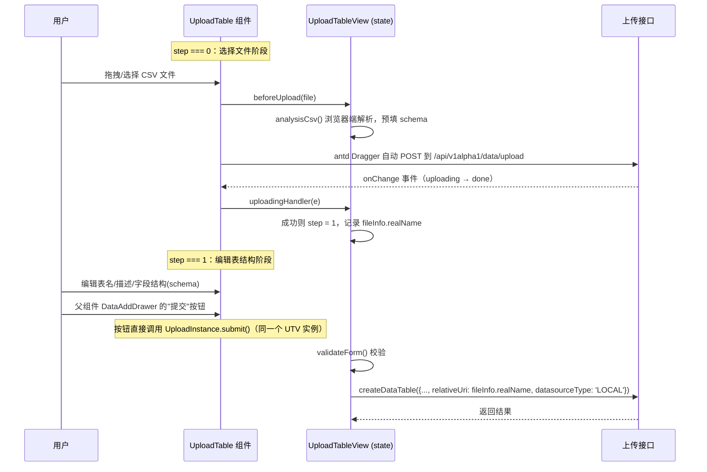

# SecretPad-Kuscia 数据注册流程概述

本文档详细描述了在 SecretPad 平台中，从前端发起一个数据源（例如 CSV 文件）的注册请求，直到数据信息在 Kuscia 中被处理和存储的完整数据流。

## 整体流程概览

数据注册的流程始于用户在 SecretPad 前端界面进行操作，该操作会触发一个 HTTP 请求到 SecretPad 的后端服务。后端服务在验证和处理后，通过 gRPC 协议与 Kuscia 进行通信，以创建相应的 `DomainDataSource` 资源。Kuscia 的 DataMesh 组件会监听到这些资源的创建，并进行后续处理。

整个流程可以分为以下几个关键步骤：

1.  **SecretPad 前端**: 用户通过 UI 界面提交数据源信息。
2.  **SecretPad 后端**: 后端服务接收前端的 HTTP 请求，并进行业务逻辑处理。
3.  **与 Kuscia 的通信**: SecretPad 后端通过 gRPC 调用 Kuscia 的 API。
4.  **Kuscia 处理**: Kuscia 接收 gRPC 请求，并创建一个 `DomainDataSource` 自定义资源（CRD）。
5.  **DataMesh 处理**: DataMesh 监听到 `DomainDataSource` 资源的创建，并进行相应的处理。

## 详细步骤

### 步骤 1: SecretPad 前端

-   **用户操作**: 用户在 SecretPad 的前端界面中，打开“注册数据源”的弹窗。
-   **代码入口**: `secretpad/frontend-src/apps/platform/src/modules/data-source-list/components/create-data-source/index.tsx`
-   **核心逻辑**:
    -   `CreateDataSourceModal` React 组件负责收集用户输入的数据源信息，例如数据源名称、类型、以及文件路径等。
    -   当用户点击“确定”按钮后，会调用 `handleOk` 方法。
    -   `handleOk` 方法会调用 `dataSourceService.addDataSource` 来发起一个 API 请求。
-   **API 请求**:
    -   `dataSourceService.addDataSource` 位于 `secretpad/frontend-src/apps/platform/src/modules/data-source-list/data-source-list.service.ts`。
    -   该服务会将前端表单收集的数据转换成一个 JSON 对象，并调用 `DataSourceController` 的 `create` 方法，向后端发送一个 POST 类型的 HTTP 请求。
    -   请求的 URL 通常是 `/api/v1alpha1/datasource/create`。

### 步骤 2: SecretPad 后端

-   **控制器**: `secretpad/secretpad-web/src/main/java/org/secretflow/secretpad/web/controller/DataSourceController.java`
-   **核心逻辑**:
    -   `DataSourceController` 中的 `create` 方法接收到前端发来的 HTTP 请求。
    -   该控制器会调用 `DatasourceService` 的 `createDatasource` 方法来处理具体的业务逻辑。
-   **服务层**: `secretpad/secretpad-service/src/main/java/org/secretflow/secretpad/service/impl/DatasourceServiceImpl.java`
-   **核心逻辑**:
    -   `DatasourceServiceImpl` 的 `createDatasource` 方法中，会使用一个 `datasourceHandlerMap`。这是一个策略模式的应用，根据数据源的类型（例如 `OSS`）来选择一个合适的 `DatasourceHandler`。
    -   对于 Kuscia 的数据源，会选择 `OssKusciaControlDatasourceHandler`。

### 步骤 3: 与 Kuscia 的通信

-   **Handler**: `secretpad/secretpad-service/src/main/java/org/secretflow/secretpad/service/handler/datasource/OssKusciaControlDatasourceHandler.java`
-   **核心逻辑**:
    -   该 Handler 会调用 `createDatasourceInKuscia` 方法，这是 SecretPad 与 Kuscia 进行交互的桥梁。
    -   在这个方法中，会构建一个 gRPC 请求，并使用 `kusciaGrpcClientAdapter` 来调用 Kuscia 的 API。
-   **gRPC 客户端**: `secretpad/secretpad-api/client-java-kusciaapi/src/main/java/org/secretflow/secretpad/kuscia/v1alpha1/service/impl/KusciaGrpcClientAdapter.java`
-   **核心逻辑**:
    -   `KusciaGrpcClientAdapter` 封装了所有对 Kuscia gRPC 服务的调用。
    -   `createDomainDataSource` 方法会向目标 Kuscia 节点发送一个 gRPC 请求。
    -   gRPC 的 Channel 是通过 `DynamicKusciaChannelProvider` 动态管理的。

### 步骤 4: Kuscia 处理

-   **gRPC 服务端**: `kuscia/pkg/kusciaapi/handler/grpchandler/domaindata_source_handler.go`
-   **核心逻辑**:
    -   `domainDataSourceHandler` 实现了 `DomainDataSourceServiceServer` 接口，负责接收从 SecretPad 发来的 gRPC 请求。
    -   `CreateDomainDataSource` 方法是 gRPC 服务的入口，它会将请求传递给底层的 `domainDataSourceService`。
-   **核心服务**: `kuscia/pkg/kusciaapi/service/domaindata_source.go`
-   **核心逻辑**:
    -   `domainDataSourceService` 中的 `CreateDomainDataSource` 方法是 Kuscia 中处理数据源注册的核心。
    -   它会进行请求验证，对敏感信息进行加密，然后创建一个 `DomainDataSource` 类型的 Kubernetes 自定义资源 (CR)。
    -   **关键点**: Kuscia 本身并不直接管理数据源，而是通过创建 CR 的方式，将数据源信息交由 Kubernetes API Server 托管。这遵循了 Kubernetes 的 Operator 设计模式。

### 步骤 5: DataMesh 处理

-   **DataMesh 的角色**: DataMesh 在数据注册流程中扮演的是一个“消费者”或“控制器”的角色。它本身不直接参与 gRPC 的调用，而是通过监听 `DomainDataSource` 资源的变化来做出响应。
-   **入口**: `kuscia/pkg/datamesh/commands/root.go`
-   **核心逻辑**:
    -   DataMesh 服务启动时，会初始化一个 `OperatorBean`。
-   **Operator**: `kuscia/pkg/datamesh/metaserver/service/operator.go`
-   **核心逻辑**:
    -   `operatorService` 的 `Start` 方法会通过与 Kubernetes API 交互来确保一个默认的 `DomainDataSource` 被注册。
    -   这表明 DataMesh 会消费 `DomainDataSource` 资源，并可能在此基础上提供数据访问、数据授权等功能。

## 数据存储与传输总结

-   **前端到后端**:
    -   **传输**: 通过 HTTP POST 请求传输 JSON 数据。
    -   **接口**: `/api/v1alpha1/datasource/create`
-   **后端内部**:
    -   **存储**: 数据源信息在被处理的过程中，暂时存储在 Java 对象中。最终会持久化到 SecretPad 的数据库中。
-   **后端到 Kuscia**:
    -   **传输**: 通过 gRPC 协议进行通信。
    -   **接口**: `DomainDataSourceService.CreateDomainDataSource`
-   **Kuscia 内部**:
    -   **存储**: 数据源的元信息（不包括原始数据）被存储为 `DomainDataSource` CR，并由 Kubernetes 的 etcd 进行持久化。
    -   **数据**: 原始数据（如 CSV 文件）的位置信息（例如 OSS 路径）被包含在 CR 的 `spec` 中。

**DomainDataSource 与 DomainData 的关系**：

- `DomainDataSource` 只描述“数据源的连接配置”（如一个 OSS bucket、一个 MySQL 实例）。
- 真正表示“某张表/某个文件”的是 `DomainData` CR，它通过 `spec.dataSource` 引用 `DomainDataSource`，并通过 `spec.relativeURI` 指定该数据源下的具体对象/路径/表名。
- 因此，完整的数据注册通常涉及两类 CRD：先注册 `DomainDataSource`（或复用默认数据源），再注册引用它的 `DomainData`。

通过这种方式，SecretPad 和 Kuscia 实现了解耦，并利用了 Kubernetes 的声明式 API 和控制器模式来管理数据源，保证了系统的可扩展性和鲁棒性。

# Kuscia CSV 数据注册数据流详解

> 范围：从 SecretPad 前端上传 CSV，经 SecretPad 后端、Kuscia，到 DataMesh 完成数据注册的完整链路。
> 版本依据：当前 workspace 中的 `secretpad`、`kuscia` 源码。
>
> **关键前提**：CSV 本地上传拆分为两个独立的 REST 接口——
> 1. `POST /api/v1alpha1/data/upload`：仅将文件落到 SecretPad 后端本地磁盘，返回随机文件名；
> 2. `POST /api/v1alpha1/datatable/create`：使用上一步返回的随机文件名作为 `relativeUri`，向 Kuscia 创建 `DomainData` CR。
> 只有完成第二步，Kuscia/DataMesh 才可以通过 `domaindata_id` 识别并访问该文件。

---
##  0.前端数据管理（`data-manager`）完整组件树
从触发按钮到具体提交接口的完整父子关系。

### 1 组件树全貌



### 2 触发链路时序（点击"添加数据"按钮为例）



### 3 本地上传（LOCAL 类型）独立流程

`UploadTable` 走的是与上面完全不同的两阶段流程，且与 `DataAddDrawer` 通过**共享 `UploadTableView` 单例**（而非 props）联动：



### 4 各组件职责一览表

| 组件/文件                                                    | 是否有 `Model`                   | 职责                                                         |
| ------------------------------------------------------------ | -------------------------------- | ------------------------------------------------------------ |
| `DataManagerComponent` / `DataManagerView`                   | ✅                                | 数据表列表展示、筛选、分页、删除、刷新状态；控制三个抽屉的显隐 |
| `DataAddDrawer` / `AddDataSheetService`                      | ✅                                | 添加数据主抽屉；管理"所属数据源/所属节点/ODPS信息"拉取；非 LOCAL 类型的表单提交 |
| `DataTableStructure` / `DataTableStructureService`           | ✅                                | 字段结构（`features`/`schema`）编辑、行增删、字段校验错误展示（add-data 和 data-table-info 各有一份，职责不同：前者可编辑，后者只读展示） |
| `OdpsPartition`                                              | ❌（无独立 Model，依赖父 `Form`） | ODPS 数据源的分区配置表单项                                  |
| `HttpQueryExample`                                           | ❌                                | HTTP 数据源查询示例的静态说明展示                            |
| `UploadTable` / `UploadTableView`                            | ✅                                | 本地文件上传的两阶段流程（上传文件 → 编辑结构 → 提交建表），完全独立于 `AddDataSheetService` |
| `DataTableAuth` / `DataTableAuthComponent` / `DatatableInfoService` | ✅                                | 数据表授权到项目的管理抽屉                                   |
| `DataTableInfoDrawer` / `DataTableInfoDrawerView`            | ✅                                | 数据表详情只读展示抽屉（含结构、授权信息等 Tab）             |

---

## 1. 总体架构概览

```
┌─────────────────────────────────────────────────────────────────────────────┐
│                              SecretPad 前端                                  │
│  页面：数据管理 → 添加数据 → 本地上传 CSV → 编辑 schema → 提交注册              │
│                                                                              │
│  阶段① 上传 CSV：     POST /api/v1alpha1/data/upload (multipart/form-data)    │
│  阶段② 提交注册：     POST /api/v1alpha1/datatable/create (JSON)              │
└──────────────────────────────┬──────────────────────────────────────────────┘
                               │
                               │ 阶段①：HTTP multipart 上传
                               ▼
┌─────────────────────────────────────────────────────────────────────────────┐
│                  SecretPad 后端 —— 阶段①：本地文件落盘（不上 Kuscia）           │
│  DataController.upload → DataServiceImpl.upload                                │
│  行为：权限/文件名校验 → 生成随机文件名 → 写入本地磁盘                          │
│  落盘路径：${secretpad.data.dir-path}/{nodeId}/{random}.csv                   │
│  返回：UploadDataResultVO { name, realName, datasource="default-data-source" } │
└──────────────────────────────┬──────────────────────────────────────────────┘
                               │
                               │ 阶段②：HTTP JSON 提交注册
                               ▼
┌─────────────────────────────────────────────────────────────────────────────┐
│             SecretPad 后端 —— 阶段②：调用 Kuscia 创建 DomainData              │
│  DatatableController.createDataTable                                           │
│    → DatatableServiceImpl.createDataTable                                      │
│    → LocalKusciaControlDatatableHandler                                        │
│    → KusciaGrpcClientAdapter.createDomainData(...)                            │
│  使用 upload 返回的 realName 作为 relativeUri，datasourceId="default-data-source"│
└──────────────────────────────┬──────────────────────────────────────────────┘
                               │ gRPC
                               ▼
┌─────────────────────────────────────────────────────────────────────────────┐
│                           KusciaAPI (Kuscia 侧)                              │
│  gRPC :8083 / HTTP :8082                                                     │
│  接口：DomainDataService.CreateDomainData                                     │
│       DomainDataSourceService.CreateDomainDataSource                          │
│  写入 Kubernetes CRD：DomainData / DomainDataSource / DomainDataGrant         │
└──────────────────────────────┬──────────────────────────────────────────────┘
                               │ 共享 CRD / 内部调用
                               ▼
┌─────────────────────────────────────────────────────────────────────────────┐
│                           DataMesh (Kuscia 内置模块)                          │
│  MetaServer：HTTP :8070 / gRPC :8071                                         │
│  DataServer：Arrow Flight :8071（实际字节读写）                                │
│  实际存储：localfs / oss / mysql / postgresql                                 │
└─────────────────────────────────────────────────────────────────────────────┘
```

**核心原则**：
- **元数据**（表名、列、类型、relativeURI 等）以 Kubernetes CRD 形式持久化。
- **实际文件内容**由 SecretPad 后端先写入本地磁盘，Kuscia/DataMesh 通过 `default-data-source`（localfs）指向同一份存储（或后续通过 DataMesh Flight 上传）。
- **CSV 本地上传是“先落盘、后注册”的两阶段过程**：
  1. `POST /api/v1alpha1/data/upload` 只把文件落到 SecretPad 后端本地磁盘，不上 Kuscia；
  2. `POST /api/v1alpha1/datatable/create`（或旧的 `/api/v1alpha1/data/create`）才使用上传返回的随机文件名作为 `relativeUri`，向 Kuscia 创建 `DomainData` CR。只有完成第二步，DataMesh 才能通过 `domaindata_id` 访问该文件。

### 1.1 DomainData 与 DomainDataSource 的绑定关系

在 Kuscia 数据模型中，**DomainData** 与 **DomainDataSource 是两类相互绑定、缺一不可的 CRD**：

| CRD | 作用 | 关键字段 |
|-----|------|----------|
| **DomainDataSource** | 描述“数据源的连接/存储配置” | `name`（即 `datasource_id`）、`type`（localfs/oss/mysql/odps/...）、`uri`、`data`（加密后的连接信息）、`accessDirectly` |
| **DomainData** | 描述“具体的数据资产/表/文件元数据” | `name`（即 `domaindata_id`）、`type`（table/model/...）、`dataSource`（引用 DomainDataSource 的 id）、`relativeURI`、`columns`、`fileFormat` |

**绑定规则**：

1. **DomainData 必须引用一个已存在的 DomainDataSource**。
   - `DomainData.spec.dataSource = <datasource_id>` 是实际的外键。
   - 创建 DomainData 时，KusciaAPI 会调用 `CheckDomainDataSourceExists` 校验该数据源是否已存在；不存在则返回错误。
2. **DomainDataSource 可以独立存在**，代表一个已注册的数据源连接（如一个 OSS bucket、一个 MySQL 实例、ODPS project）。
3. **一个 DomainDataSource 可以被多个 DomainData 引用**。例如同一个 OSS bucket 下可以注册多张表，每张表对应一个 DomainData，但共享同一个 DomainDataSource。
4. **实际存储路径/对象的解析需要两者共同决定**：
   - `localfs`：`DomainDataSource.info.localfs.path + "/" + DomainData.relativeURI`
   - `oss`：`DomainDataSource.info.oss.prefix + "/" + DomainData.relativeURI`
   - `mysql/postgresql`：`DomainData.relativeURI` 作为表名，`DomainDataSource.info.database` 作为连接信息
   - `odps`：`DomainDataSource.info.odps.project/endpoint + DomainData.relativeURI`

**在数据注册流程中的体现**：

- **CSV 本地上传**：SecretPad 后端只创建 `DomainData`，`DomainDataSource` 使用 Kuscia 启动时自动创建的 `default-data-source`（type=localfs，path=/home/kuscia/var/storage/data）。从接口视角分为两步：
  1. 调用 `POST /api/v1alpha1/data/upload` 将 CSV 落到 SecretPad 本地磁盘 `/app/data/{nodeId}/{random}.csv`，返回随机文件名 `realName`；
  2. 调用 `POST /api/v1alpha1/datatable/create`，将 `realName` 作为 `relativeUri`、`datasourceId` 设为 `default-data-source`，向 Kuscia 创建 `DomainData`。
- **OSS / MYSQL / ODPS 数据表注册**：通常分为两步（虽然用户感知上是一步）：
  1. SecretPad 后端先创建 `DomainDataSource`（保存 endpoint、ak/sk、bucket/database 等连接信息）。
  2. 再创建 `DomainData`，其中 `datasourceId` 指向上一步创建的 DomainDataSource，`relativeUri` 表示该数据源下的相对路径/表名。

---

## 2. 详细数据流步骤

### 步骤 1：SecretPad 前端 —— 上传 CSV

#### 2.1.1 入口页面与组件

| 文件 | 作用 |
|------|------|
| `secretpad/frontend-src/apps/platform/src/modules/data-manager/data-manager.view.tsx` | 数据管理页面，含“添加数据”按钮 |
| `secretpad/frontend-src/apps/platform/src/modules/data-table-add/add-data/add-data.view.tsx` | 选择数据源类型（LOCAL / OSS / ODPS / MYSQL / HTTP） |
| `secretpad/frontend-src/apps/platform/src/modules/data-table-add/component/upload-table/upload-table.view.tsx` | LOCAL 模式下的 CSV 上传与 schema 编辑 |
data-manager.view.tsx 中的按钮点击事件：


以下是结果（按实际触发顺序）：
- apps/platform/src/modules/data-manager/data-manager.view.tsx
  - Button onClick 调用 viewInstance.addData()
  - DataManagerView.addData()：this.showDataAddDrawer = true
  - 触发 DataManagerComponent 重新渲染，<DataAddDrawer visible={viewInstance.showDataAddDrawer} ... /> 的 visible 变为 true
- apps/platform/src/modules/data-table-add/add-data/add-data.view.tsx
    - useEffect(() => { if (visible) { ... } }, [visible]) 被触发
  - 在 if (visible) 分支内执行：
      - getDataSourceList()
    - form.setFieldValue('features', [{}])
- apps/platform/src/modules/data-table-add/add-data/add-data.view.tsx
    - getDataSourceList() 内调用：
      - viewInstance.queryDataSourceList(ownerId as string)
- apps/platform/src/modules/data-table-add/add-data/add-data-service.ts
    - AddDataSheetService.queryDataSourceList(ownerId) 执行
  - 里面调用接口：list(...)
   - 成功后更新：
     - this.dataSourceList
     - this.dataSourceOptions
- apps/platform/src/modules/data-table-add/add-data/add-data.view.tsx
    - Drawer open={visible} 生效，抽屉展示
  - Form 和基础表单项渲染（数据源下拉等）

**后续会不会继续触发函数，取决于用户在抽屉里的操作：**
- 当用户选择数据源后（dataSourceFormValue 变化）：
    - apps/platform/src/modules/data-table-add/add-data/add-data.view.tsx 的 useEffect([dataSourceFormValue]) 触发
  - 条件满足（自治模式）会调用：
      - getNodeNameList() -> viewInstance.queryNodeNameList(...)
    - 若是 ODPS：getOdpsSourceProject() -> viewInstance.queryOdpsSourceDetail(...)
- 对应 service 方法：
    - apps/platform/src/modules/data-table-add/add-data/add-data-service.ts
      - queryNodeNameList(ownerId, datasourceId)（内部按 DEFAULT_DATA_SOURCE 分支走 listNode() 或 nodes(...)）
      - queryOdpsSourceDetail(params)（ODPS 分支）
#### 2.1.2 上传调用

使用 Ant Design `Upload.Dragger` 直接发起 multipart 上传：

```tsx
<Dragger
  name="file"
  accept=".csv"
  action="/api/v1alpha1/data/upload"
  data={{ 'Node-Id': viewInstance.ownerId }}
  headers={{
    'Node-Id': viewInstance.ownerId,
    'User-Token': localStorage.getItem('User-Token') || '',
  }}
/>
```

前端 API 封装：（根据后端代码自动生成的 API：）

```ts
// secretpad/frontend-src/apps/platform/src/services/secretpad/DataController.ts
export async function upload(
  params: { 'Node-Id'?: string },
  files?: File[],
) {
  const formData = new FormData();
  formData.append('file', files[0] || '');
  return request<API.SecretPadResponse_UploadDataResultVO_>(
    '/api/v1alpha1/data/upload',
    { method: 'POST', params, data: formData },
  );
}
```

上传成功后返回：

```ts
interface UploadDataResultVO {
  name: string;          // 原始文件名
  realName: string;      // 随机化后的磁盘文件名
  datasource: string;    // "default-data-source"
  datasourceType: string;// "localfs"
}
```

#### 2.1.3 CSV 解析（前端）

- 文件：`secretpad/frontend-src/apps/platform/src/modules/data-table-add/component/upload-table/util.ts`
- 使用 `Papa.parse` 解析 CSV，`jschardet` 检测编码。
- `parseDataTableColumns()` 自动推断列类型：`int` / `float` / `str`。

---

### 步骤 2：SecretPad 后端 —— 接收并落盘 CSV

#### 2.2.1 Controller

| 文件 | 接口 |
|------|------|
| `secretpad/secretpad-web/src/main/java/org/secretflow/secretpad/web/controller/DataController.java` | `POST /api/v1alpha1/data/upload` |

方法签名（示意）：

```java
public SecretPadResponse<UploadDataResultVO> upload(
        @RequestParam("file") MultipartFile file,
        @RequestHeader("Node-Id") String nodeId)
```

#### 2.2.2 权限与校验

1. **登录校验**：`LoginInterceptor` 读取 `User-Token` 验证会话。
2. **数据权限**：`@DataResource(field = "ownerId", resourceType = NODE_ID)` + `DataResourceAspect` → 校验当前用户是否拥有该节点权限。
3. **上传校验**：仅允许 `.csv`、文件名不能含 `/` 或 `\`、nodeId 不能含路径字符。

#### 2.2.3 Service 落盘

文件：`secretpad/secretpad-service/src/main/java/org/secretflow/secretpad/service/impl/DataServiceImpl.java`

```java
public UploadDataResultVO upload(MultipartFile file, String nodeId) {
    checkDataPermissions(nodeId);
    String fileName = file.getOriginalFilename();
    fileNameCheck(fileName);
    nodeIdValidCheck(nodeId);

    String dirPath = storeDir + nodeId + FILE_SEPETATOR;
    String randomFileName = getRandomFileName(fileName);
    File target = new File(dirPath + randomFileName);

    // 路径白名单检查，防止目录遍历
    SafeFileUtils.checkPathInWhitelist(target, List.of(storeDir));
    file.transferTo(target);
    FileUtils.removeBOMFromFile(dirPath + randomFileName);

    return UploadDataResultVO.builder()
            .name(fileName)
            .realName(randomFileName)
            .datasource(DEFAULT_DATASOURCE)        // "default-data-source"
            .datasourceType(DEFAULT_DATASOURCE_TYPE) // "localfs"
            .build();
}
```

- 默认落盘目录：`secretpad.data.dir-path`（默认 `/app/data/`）。
- 最终路径：`/app/data/{nodeId}/{randomFileName}.csv`
- 常量定义：`secretpad/secretpad-common/src/main/java/org/secretflow/secretpad/common/constant/DomainDatasourceConstants.java`

> **重要说明：`upload` 接口只负责本地落盘，不会向 Kuscia 注册 DomainData**
>
> `POST /api/v1alpha1/data/upload` 的处理逻辑全部在 `DataServiceImpl.upload(...)` 中：
> - 校验权限、文件名、nodeId；
> - 生成随机文件名；
> - 将文件写入 SecretPad 后端本地磁盘；
> - 返回 `UploadDataResultVO`（含原始文件名 `name`、随机文件名 `realName`、默认数据源 `datasource="default-data-source"`、类型 `datasourceType="localfs"`）。
>
> 该接口**不会**构造 `CreateDomainDataRequest`，也**不会**调用 Kuscia gRPC。此时 Kuscia 中尚不存在对应的 `DomainData` CR，DataMesh 还无法通过 `domaindata_id` 访问该文件。

---

### 步骤 3：SecretPad 前端 —— 提交数据表注册

用户编辑表名、描述、schema 后，调用：

```ts
// secretpad/frontend-src/apps/platform/src/services/secretpad/DatatableController.ts
createDataTable({
  ownerId: currentOwnerId,
  nodeIds: [this.ownerId],
  datatableName: values.tbl_name,
  desc: values.tbl_desc,
  columns: values.schema.map((item) => ({
    colName: item.featureName,
    colType: item.featureType,
    colComment: item.featureDescription || '',
  })),
  relativeUri: this.fileInfo?.realName,     // 上传返回的随机文件名
  datasourceType: 'LOCAL',
  datasourceName: 'default-data-source',
  datasourceId: 'default-data-source',
  nullStrs: values.tbl_nullStrs ? JSON.parse(`[${values.tbl_nullStrs}]`) : [],
});
```

请求类型：`POST /api/v1alpha1/datatable/create`

> **这一步才把已上传的文件注册到 Kuscia**
>
> `createDataTable`（后端入口 `DatatableController.createDataTable` / `DatatableServiceImpl.createDataTable`）收到请求后：
> 1. 根据 `datasourceType='LOCAL'` 路由到 `LocalKusciaControlDatatableHandler`；
> 2. 使用 `relativeUri`（即 `upload` 返回的 `realName`）构造 `CreateDomainDataRequest`；
> 3. 通过 `KusciaGrpcClientAdapter.createDomainData(...)` 调用 KusciaAPI；
> 4. Kuscia 创建 `v1alpha1.DomainData` CR，`spec.dataSource = "default-data-source"`，`spec.relativeURI = realName`；
> 5. 返回 `domaindata_id` 给前端，数据表注册完成。
>
> 因此，**CSV 本地上传 = 先 `upload`（本地落盘） + 后 `createDataTable`（Kuscia 注册）**，两个接口缺一不可。
>
> 另： SecretPad 早期还提供 `POST /api/v1alpha1/data/create`（`DataController.createData` → `DataManager.createData`），其本质与 `createDataTable` 相同——都是在上传落盘后，向 Kuscia 发起 `CreateDomainData` 调用完成注册。当前前端数据管理页面已统一使用 `/api/v1alpha1/datatable/create`，`data/create` 标记为 `@Deprecated(forRemoval = true)`。

---

### 步骤 4：SecretPad 后端 —— 构建 Kuscia 请求并调用 gRPC

#### 2.4.1 Controller

| 文件 | 接口 |
|------|------|
| `secretpad/secretpad-web/src/main/java/org/secretflow/secretpad/web/controller/DatatableController.java` | `POST /api/v1alpha1/datatable/create` |

方法上有权限注解：

```java
@DataResource(field = "ownerId", resourceType = DataResourceTypeEnum.NODE_ID)
@ApiResource(code = ApiResourceCodeConstants.DATATABLE_CREATE)
```

#### 2.4.2 DTO

文件：`secretpad/secretpad-service/src/main/java/org/secretflow/secretpad/service/model/datatable/CreateDatatableRequest.java`

```java
@Data
public class CreateDatatableRequest {
    @NotBlank private String ownerId;
    @NotEmpty private List<@NotBlank String> nodeIds;
    @NotBlank @Size(max = 32) private String datatableName;
    @NotBlank private String datasourceId;
    @NotBlank private String datasourceName;
    @NotBlank @OneOfType(types = {OSS, ODPS, MYSQL, HTTP, LOCAL})
    private String datasourceType;
    @Size(max = 100) private String desc;
    @NotBlank private String relativeUri;
    @NotEmpty private List<TableColumnVO> columns;
    private OdpsPartitionRequest partition;
    private List<String> nullStrs;
}
```

**关键字段说明**：

- `datasourceId`：必填，指向 Kuscia 中已存在的 `DomainDataSource` 的 id。对于 CSV 本地上传，该值为 `default-data-source`；对于 OSS/MYSQL/ODPS，则为之前注册数据源时生成的 id（如 `oss-xxxxxxxx`）。
- `datasourceName`：数据源的显示名称，仅作为 DomainData 的 attribute 存储，不参与实际存储解析。
- `datasourceType`：数据源类型（LOCAL / OSS / MYSQL / ODPS / HTTP），决定后端使用哪个 `DatatableHandler`。
- `relativeUri`：相对于 DomainDataSource 的相对路径/对象名/表名。对于 CSV 本地文件，它是 SecretPad 上传时生成的随机文件名；对于 OSS，它是 bucket 前缀下的对象 key；对于 MySQL，它是表名。

#### 2.4.3 Service 分发

文件：`secretpad/secretpad-service/src/main/java/org/secretflow/secretpad/service/impl/DatatableServiceImpl.java`

```java
@Override
public CreateDatatableVO createDataTable(CreateDatatableRequest req) {
    verifyRate();
    verifyNodes(req);
    return datatableHandlerMap
            .get(DataSourceTypeEnum.valueOf(req.getDatasourceType()))
            .createDatatable(req);
}
```

`LOCAL` 类型对应处理器：

```java
LocalKusciaControlDatatableHandler
```

文件：`secretpad/secretpad-service/src/main/java/org/secretflow/secretpad/service/handler/datatable/LocalKusciaControlDatatableHandler.java`

#### 2.4.4 构建 CreateDomainDataRequest

```java
private Domaindata.CreateDomainDataRequest buildCreateDomainDataRequest(
        String nodeId, CreateDatatableRequest request) {
    String domainDataId = genDomainDataId();  // UUIDUtils.random(8)

    List<Common.DataColumn> columns = request.getColumns().stream()
            .map(column -> Common.DataColumn.newBuilder()
                    .setName(column.getColName())
                    .setType(column.getColType())
                    .setComment(StringUtils.defaultString(column.getColComment()))
                    .build())
            .collect(Collectors.toList());

    return Domaindata.CreateDomainDataRequest.newBuilder()
            .setDomaindataId(domainDataId)
            .setDomainId(nodeId)
            .setName(request.getDatatableName())
            .setType("table")
            .setFileFormat(Common.FileFormat.CSV)
            .putAttributes("DatasourceType", request.getDatasourceType())
            .putAttributes("DatasourceName", request.getDatasourceName())
            .putAttributes(DomainDataConstants.NULL_STRS,
                    JsonUtils.toJSONString(request.getNullStrs()))
            .setDatasourceId(request.getDatasourceId())
            .setRelativeUri(request.getRelativeUri())
            .putAttributes("description", StringUtils.defaultString(request.getDesc()))
            .addAllColumns(columns)
            .build();
}
```

**说明**：
- `setDatasourceId(...)` 设置的是 DomainData 对 DomainDataSource 的引用。Kuscia 创建 DomainData CR 时，该值会写入 `spec.dataSource`。
- `setRelativeUri(...)` 表示该数据资产在 DomainDataSource 所描述的存储空间中的相对位置。
- 二者共同构成 DataMesh 后续解析实际存储路径的完整坐标。

#### 2.4.5 gRPC 调用 Kuscia

SecretPad 后端通过动态 gRPC 通道调用 KusciaAPI：

- 通道提供者：
  `secretpad/secretpad-api/client-java-kusciaapi/src/main/java/org/secretflow/secretpad/kuscia/v1alpha1/DynamicKusciaChannelProvider.java`
- gRPC 适配器：
  `secretpad/secretpad-api/client-java-kusciaapi/src/main/java/org/secretflow/secretpad/kuscia/v1alpha1/service/impl/KusciaGrpcClientAdapter.java`

```java
public Domaindata.CreateDomainDataResponse createDomainData(
        Domaindata.CreateDomainDataRequest request, String domainId) {
    return dynamicKusciaChannelProvider
            .createStub(domainId, DomainDataServiceGrpc.DomainDataServiceBlockingStub.class)
            .createDomainData(request);
}
```

处理多节点注册时，会并发对每个 `nodeId` 发起调用，收集成功/失败结果：

```java
private KusciaResponse<Domaindata.CreateDomainDataResponse> createDomainData(
        Domaindata.CreateDomainDataRequest request) {
    String domainId = envService.isCenter()
            ? envService.getPlatformNodeId()
            : request.getDomainId();
    return KusciaResponse.of(
            kusciaGrpcClientAdapter.createDomainData(request, domainId),
            request.getDomainId());
}
```

返回：`CreateDatatableVO`，包含 `(nodeId, domainDataId)` 列表和失败节点映射。

#### 2.4.6 DataServiceImpl 与 DatatableServiceImpl 的关系，createData 与 createDataTable 的区别

SecretPad 后端有两套 Service/Controller 都能把数据资产注册到 Kuscia，容易混淆，这里统一说明。

**两套 Service 的职责划分**

| Service | 主要职责 | 对应 Controller | 核心方法 |
|---------|----------|-----------------|----------|
| `DataServiceImpl` | 文件上传、下载、默认数据源查询；旧版数据注册 | `DataController` | `upload(...)`、`download(...)`、`queryDataSources()`、`createData(...)`（已废弃） |
| `DatatableServiceImpl` | 数据表全生命周期管理：创建、查询、删除、推送 TEE、拉取 TEE 结果；统一的数据表注册入口 | `DatatableController` | `createDataTable(...)`、`listDatatablesByNodeId(...)`、`getDatatable(...)`、`deleteDatatable(...)`、`pushDatatableToTeeNode(...)` |

**`createData` 与 `createDataTable` 的关系与区别**

| 对比项 | `DataServiceImpl.createData` | `DatatableServiceImpl.createDataTable` |
|--------|------------------------------|----------------------------------------|
| **REST 路径** | `POST /api/v1alpha1/data/create` | `POST /api/v1alpha1/datatable/create` |
| **维护状态** | `@Deprecated(forRemoval = true)`，即将移除 | 当前正式接口 |
| **前端使用情况** | 早期版本使用，当前数据管理页面已不再调用 | 当前前端“添加数据”统一使用的注册接口 |
| **数据源类型支持** | 仅适合 LOCAL/localfs 场景（代码写死走 `DataManager.createData`） | 支持 LOCAL、OSS、MYSQL、ODPS、HTTP 等多种类型，通过 `datatableHandlerMap` 策略分发 |
| **内部调用链** | `DataController.createData` → `DataServiceImpl.createData` → `DataManager.createData` → `KusciaGrpcClientAdapter.createDomainData(...)` | `DatatableController.createDataTable` → `DatatableServiceImpl.createDataTable` → 按 `datasourceType` 选择 `DatatableHandler`（LOCAL 走 `LocalKusciaControlDatatableHandler`）→ `KusciaGrpcClientAdapter.createDomainData(...)` |
| **最终效果** | 在 Kuscia 中创建 `DomainData` CR | 在 Kuscia 中创建 `DomainData` CR |

**共同点**：两者最终都是调用 KusciaAPI 的 `DomainDataService.CreateDomainData`，把 `relativeUri`、`datasourceId`、`columns` 等元数据写入 `v1alpha1.DomainData` CR。对于 CSV 本地上传，都需要先经过 `upload` 拿到 `realName`，再把 `realName` 作为 `relativeUri` 提交注册。

**为什么当前用 `createDataTable` 替代 `createData`**：

1. `createDataTable` 采用策略模式（`Map<DataSourceTypeEnum, DatatableHandler>`），一种接口统一处理 LOCAL/OSS/MYSQL/ODPS/HTTP 等多种数据源，便于扩展；
2. `createDataTable` 与数据表列表、详情、删除、授权、TEE 推送等接口同属于 `DatatableService`，职责内聚；
3. `createData` 只保留了 LOCAL 直调的简单路径，已无法满足多数据源注册需求，因此标记废弃。

> **一句话总结**：
> - `upload` 只落盘，不上 Kuscia；
> - `createData` 是旧的 Kuscia 注册接口（已废弃）；
> - `createDataTable` 是当前统一的 Kuscia 注册接口，LOCAL 类型背后也是创建 `DomainData`。

---

### 步骤 5：KusciaAPI —— 接收并写入 CRD

#### 2.5.1 gRPC 服务定义

Proto 文件：`kuscia/proto/api/v1alpha1/kusciaapi/domaindata.proto`

```proto
service DomainDataService {
  rpc CreateDomainData(CreateDomainDataRequest) returns (CreateDomainDataResponse);
  rpc UpdateDomainData(UpdateDomainDataRequest) returns (UpdateDomainDataResponse);
  rpc DeleteDomainData(DeleteDomainDataRequest) returns (DeleteDomainDataResponse);
  rpc DeleteDomainDataAndRaw(DeleteDomainDataRequest) returns (DeleteDomainDataResponse);
  rpc QueryDomainData(QueryDomainDataRequest) returns (QueryDomainDataResponse);
  rpc BatchQueryDomainData(BatchQueryDomainDataRequest) returns (BatchQueryDomainDataResponse);
  rpc ListDomainData(ListDomainDataRequest) returns (ListDomainDataResponse);
}
```

关键消息：

```proto
message CreateDomainDataRequest {
  RequestHeader header = 1;
  string domaindata_id = 2;
  string name = 3;
  string type = 4;            // table
  string relative_uri = 5;    // 上传返回的随机文件名
  string domain_id = 6;       // 节点 ID / namespace
  string datasource_id = 7;   // 引用 DomainDataSource 的 id
  map<string, string> attributes = 8;
  Partition partition = 9;
  repeated DataColumn columns = 10;
  string vendor = 11;
  FileFormat file_format = 12;// CSV
}
```

**`datasource_id` 的作用**：它不是数据源显示名，而是 DomainData 对 DomainDataSource CR 的**外键引用**。后续 DataMesh 会根据这个 id 查询 DomainDataSource，进而获取存储类型、连接信息、根路径等。

#### 2.5.2 服务端注册

文件：`kuscia/pkg/kusciaapi/bean/grpc_server_bean.go`

```go
kusciaapi.RegisterDomainDataServiceServer(server,
    grpchandler.NewDomainDataHandler(service.NewDomainDataService(s.config, s.cmConfigService)))
```

Handler：`kuscia/pkg/kusciaapi/handler/grpchandler/domaindata_handler.go`

```go
func (h *domainDataHandler) CreateDomainData(ctx context.Context, request *kusciaapi.CreateDomainDataRequest) (*kusciaapi.CreateDomainDataResponse, error) {
    return h.domainDataService.CreateDomainData(ctx, request), nil
}
```

#### 2.5.3 HTTP 端点

文件：`kuscia/pkg/kusciaapi/bean/http_server_bean.go`

```go
{
    Group: "api/v1/domaindata",
    Routes: []*router.Router{
        {HTTPMethod: http.MethodPost, RelativePath: "create", ...},
        ...
    }
}
```

外部可访问地址：

```text
POST https://<kuscia-host>:8082/api/v1/domaindata/create
```

#### 2.5.4 Service 创建 DomainData CRD

文件：`kuscia/pkg/kusciaapi/service/domaindata_service.go`

1. **请求规范化**（normalization）：

```go
func (s domainDataService) normalizationCreateRequest(request *kusciaapi.CreateDomainDataRequest) {
    if request.Name == "" {
        uris := strings.Split(request.RelativeUri, "/")
        request.Name = uris[len(uris)-1]
    }
    if request.DomaindataId == "" {
        request.DomaindataId = common.GenDomainDataID(request.Name)
    }
    if request.DatasourceId == "" {
        request.DatasourceId = common.DefaultDataSourceID   // "default-data-source"
    }
    if request.Vendor == "" {
        request.Vendor = common.DefaultDomainDataVendor      // "manual"
    }
    request.RelativeUri = strings.TrimPrefix(request.RelativeUri, string(filepath.Separator))
}
```

2. **构建并写入 DomainData CRD**：

```go
kusciaDomainData := &v1alpha1.DomainData{
    ObjectMeta: metav1.ObjectMeta{
        Name:        request.DomaindataId,
        Namespace:   request.DomainId,
        Labels: map[string]string{
            common.LabelDomainDataType:        request.Type,
            common.LabelDomainDataVendor:      request.Vendor,
            common.LabelInterConnProtocolType: "kuscia",
        },
        Annotations: map[string]string{
            common.InitiatorAnnotationKey: request.DomainId,
        },
    },
    Spec: v1alpha1.DomainDataSpec{
        RelativeURI: request.RelativeUri,
        Name:        request.Name,
        Type:        request.Type,
        DataSource:  request.DatasourceId,
        Attributes:  request.Attributes,
        Partition:   common.Convert2KubePartition(request.Partition),
        Columns:     common.Convert2KubeColumn(request.Columns),
        Vendor:      customVendor,
        Author:      request.DomainId,
        FileFormat:  common.Convert2KubeFileFormat(request.FileFormat),
    },
}

_, err := s.conf.KusciaClient.KusciaV1alpha1().DomainDatas(request.DomainId).Create(...)
```

CRD 类型定义：`kuscia/pkg/crd/apis/kuscia/v1alpha1/domaindata_types.go`

```go
type DomainDataSpec struct {
    RelativeURI string            `json:"relativeURI"`
    Author      string            `json:"author"`
    Name        string            `json:"name"`
    Type        string            `json:"type"`
    DataSource  string            `json:"dataSource"`
    Attributes  map[string]string `json:"attributes,omitempty"`
    Partition   *Partition        `json:"partitions,omitempty"`
    Columns     []DataColumn      `json:"columns,omitempty"`
    Vendor      string            `json:"vendor,omitempty"`
    FileFormat  string            `json:"fileFormat,omitempty"`
}
```

**3. 校验 DomainDataSource 存在性**：

在 `kuscia/pkg/kusciaapi/service/domaindata_service.go` 中，若请求携带 `datasource_id`，KusciaAPI 会先校验对应的 DomainDataSource 是否已存在：

```go
if len(request.DatasourceId) > 0 {
    kusciaErrorCode, msg := CheckDomainDataSourceExists(
        s.conf.KusciaClient, request.DomainId, request.DatasourceId)
    if pberrorcode.ErrorCode_SUCCESS != kusciaErrorCode {
        return &kusciaapi.CreateDomainDataResponse{
            Status: utils.BuildErrorResponseStatus(kusciaErrorCode, msg),
        }
    }
}
```

若引用的 DomainDataSource 不存在，则直接返回错误，不会创建 DomainData CR。

---

### 步骤 6：DataMesh —— 元数据可见与数据可读

Kuscia 与 DataMesh 是**同一 CRD 存储的两个 API 入口**：

| 入口 | 用途 | 默认端口 |
|------|------|----------|
| KusciaAPI | 管理/元数据 API（SecretPad、脚本、管理员调用） | gRPC 8083 / HTTP 8082 |
| DataMesh MetaServer | 引擎/SDK 元数据 API | HTTP 8070 / gRPC 8071 |
| DataMesh DataServer | 实际字节读写（Arrow Flight） | gRPC/Flight 8071 |

**DataMesh 消费 DomainData 与 DomainDataSource 的方式**：

- DataMesh MetaServer 提供 `DomainDataService` 和 `DomainDataSourceService` 两套接口，底层都操作同一套 K8s CRD。
- 当 SecretFlow 任务通过 DataMesh 读取数据时，DataMesh 会先根据 `domaindata_id` 查询 `DomainData`，再根据 `DomainData.spec.dataSource` 查询 `DomainDataSource`。
- 只有同时拿到两者，才能确定实际存储类型、连接信息和完整路径/对象/表名。

#### 2.6.1 DataMesh 启动

文件：`kuscia/cmd/kuscia/modules/datamesh.go` → `kuscia/pkg/datamesh/commands/root.go`

启动三个 Bean：

```go
httpServer := bean.NewHTTPServerBean(conf, cmConfigService)
grpcServer := bean.NewGrpcServerBean(conf, cmConfigService)
opServer   := bean.NewOperatorBean(conf, cmConfigService)
```

默认端口在：`kuscia/pkg/datamesh/config/dmconfig.go`

#### 2.6.2 DataMesh gRPC/HTTP 元数据接口

Proto 文件：`kuscia/proto/api/v1alpha1/datamesh/domaindata.proto`

```proto
service DomainDataService {
  rpc CreateDomainData(CreateDomainDataRequest) returns (CreateDomainDataResponse);
  rpc QueryDomainData(QueryDomainDataRequest) returns (QueryDomainDataResponse);
  rpc UpdateDomainData(UpdateDomainDataRequest) returns (UpdateDomainDataResponse);
  rpc DeleteDomainData(DeleteDomainDataRequest) returns (DeleteDomainDataResponse);
}
```

DataMesh 的 `CreateDomainData` 实现（`kuscia/pkg/datamesh/metaserver/service/domaindata.go`）具有 **create-or-update** 语义，最终写入同样的 `v1alpha1.DomainData` CRD。

HTTP 路由（`kuscia/pkg/datamesh/bean/http_server_bean.go`）：

```go
Group: "api/v1/datamesh/domaindata"
Routes:
  POST "create"
  POST "delete"
  POST "query"
  POST "update"
```

#### 2.6.3 默认数据源 `default-data-source`

DataMesh 启动时会确保每个 domain 存在默认本地数据源：

文件：`kuscia/pkg/datamesh/metaserver/service/operator.go`

```go
func (o *operatorService) registerDefaultDatasource() bool {
    _, err := o.conf.KusciaClient.KusciaV1alpha1().DomainDataSources(...).Get(..., common.DefaultDataSourceID, ...)
    if k8serrors.IsNotFound(err) {
        o.datasourceSvc.CreateDefaultDomainDataSource(context.Background())
    }
    ...
}
```

默认数据源工厂（`kuscia/pkg/datamesh/metaserver/service/domaindatasource.go`）：

```go
info := &datamesh.DataSourceInfo{
    Localfs: &datamesh.LocalDataSourceInfo{
        Path: path.Join(s.conf.RootDir, common.DefaultDomainDataSourceLocalFSPath),
    },
}
// 默认绝对路径：/home/kuscia/var/storage/data
```

CRD 类型：`kuscia/pkg/crd/apis/kuscia/v1alpha1/domaindatasource_types.go`

```go
type DomainDataSourceSpec struct {
    URI            string            `json:"uri"`
    Name           string            `json:"name"`
    Data           map[string]string `json:"data,omitempty"` // 加密后的连接信息
    Type           string            `json:"type"`           // localfs / oss / mysql / postgresql
    InfoKey        string            `json:"infoKey,omitempty"`
    AccessDirectly bool              `json:"accessDirectly,omitempty"`
}
```

---

### 步骤 7：实际文件存储与读取

DataMesh 在读取或写入实际字节时，必须同时拿到 `DomainData` 和 `DomainDataSource`：

- `DomainData` 提供 `relativeURI`、`columns`、`fileFormat`、`partition` 等数据资产级信息。
- `DomainDataSource` 提供存储类型（localfs/oss/mysql/...）、连接信息、根路径/前缀/数据库等数据源级信息。
- 实际路径/对象的构造公式：
  - `localfs`：`DomainDataSource.info.localfs.path + "/" + DomainData.relativeURI`
  - `oss`：`DomainDataSource.info.oss.prefix + "/" + DomainData.relativeURI`
  - `mysql/postgresql`：`DomainData.relativeURI` 作为表名，`DomainDataSource.info.database` 作为连接
  - `odps`：`DomainDataSource.info.odps.project` + `DomainData.relativeURI`

#### 2.7.1 本地文件路径构造

对于 `localfs` 类型，`relativeURI` 拼接到数据源根路径：

文件：`kuscia/pkg/datamesh/dataserver/io/builtin/dataio_localfile.go`

```go
func (fio *BuiltinLocalFileIO) Read(ctx context.Context, rc *utils.DataMeshRequestContext, w utils.RecordWriter) error {
    data, ds, err := rc.GetDomainDataAndSource(ctx)
    ...
    if !isValidRelativePath(data.RelativeUri) {
        return errors.Errorf("invalid relative path: %s", data.RelativeUri)
    }
    filePath := path.Join(ds.Info.Localfs.Path, data.RelativeUri)
    file, err := os.Open(filePath)
    ...
}

func (fio *BuiltinLocalFileIO) Write(ctx context.Context, rc *utils.DataMeshRequestContext, reader *flight.Reader) error {
    data, ds, err := rc.GetDomainDataAndSource(ctx)
    filePath := path.Join(ds.Info.Localfs.Path, data.RelativeUri)
    dirPath := path.Dir(filePath)
    paths.EnsurePath(dirPath, true)
    file, err := os.OpenFile(filePath, os.O_CREATE|os.O_RDWR|os.O_TRUNC, 0600)
    ...
}
```

示例：

```text
datasource localfs path = /home/kuscia/var/storage/data
relativeURI              = {randomFileName}.csv
final file path          = /home/kuscia/var/storage/data/{randomFileName}.csv
```

**注意**：在 SecretPad 后端本地部署模式下，SecretPad 的 `/app/data/{nodeId}/{random}.csv` 与 Kuscia 的 `/home/kuscia/var/storage/data/{random}.csv` 可能是同一路径（通过 volume 挂载对齐），否则需要后续通过 DataMesh Flight 将字节写入 Kuscia 侧。

#### 2.7.2 CSV ↔ Arrow Flight 转换

文件：`kuscia/pkg/datamesh/dataserver/io/builtin/dataio.go`

读取 CSV 到 Flight 流：

```go
func DataProxyContentToFlightStreamCSV(data *datamesh.DomainData, r io.Reader, w utils.RecordWriter) error {
    colTypes, _ := utils.GenerateArrowColumnType(data)
    colNames := utils.GenerateArrowColumnNames(data)
    csvReader := csv.NewInferringReader(r,
        csv.WithColumnTypes(colTypes),
        csv.WithHeader(true),
        csv.WithNullReader(true, CSVDefaultNullValues...),
        csv.WithChunk(1024),
        csv.WithIncludeColumns(colNames),
    )
    ...
}
```

写入 Arrow Flight 流到 CSV：

```go
func FlightStreamToDataProxyContentCSV(data *datamesh.DomainData, w io.Writer, reader *flight.Reader) error {
    schema, _ := utils.GenerateArrowSchema(data)
    csvWriter := csv.NewWriter(w, reader.Schema(), csv.WithHeader(true), csv.WithNullWriter(CSVDefaultNullValue))
    for reader.Next() {
        csvWriter.Write(reader.Record())
    }
    ...
}
```

#### 2.7.3 其他存储后端

| 类型 | 路径/对象构造 | 依赖的 DomainDataSource 信息 | 实现文件 |
|------|--------------|------------------------------|----------|
| `localfs` | `path.Join(localfs.Path, relativeURI)` | `DomainDataSource.info.localfs.path` | `dataio_localfile.go` |
| `oss` | `path.Join(oss.Prefix, relativeURI)`，使用 S3 SDK | `DomainDataSource.info.oss.{bucket,prefix,endpoint,ak,sk}` | `dataio_oss.go` / `oss_uploader.go` |
| `mysql` / `postgresql` | `relativeURI` 作为表名 | `DomainDataSource.info.database.{endpoint,user,password,database}` | `dataio_mysql.go` / `dataio_postgresql.go` |
| `odps` | `relativeURI` 作为表名（可带分区） | `DomainDataSource.info.odps.{endpoint,project,accessId,accessKey}` | 经 DataProxy 处理 |

---

### 步骤 8：DataMesh Flight 数据平面

#### 2.8.1 Flight 命令

Proto 文件：`kuscia/proto/api/v1alpha1/datamesh/flightdm.proto`

```proto
enum ContentType {
  Table = 0;
  RAW   = 1;
  CSV   = 2;
}

message CommandDomainDataQuery {
  string domaindata_id = 1;
  repeated string columns = 2;
  ContentType content_type = 3;
  FileWriteOptions file_write_options = 4;
  string partition_spec = 5;
}

message CommandDomainDataUpdate {
  string domaindata_id = 1;
  CreateDomainDataRequest domaindata_request = 2;
  ContentType content_type = 3;
  FileWriteOptions file_write_options = 4;
  map<string, string> extra_options = 5;
  string partition_spec = 6;
}
```

#### 2.8.2 Flight 处理器

文件：`kuscia/pkg/datamesh/dataserver/handler/handler.go`

```go
type datameshFlightHandler struct {
    flight.BaseFlightServer
    customHandles           map[string]CustomActionHandler
    domainDataService       service.IDomainDataService
    domainDataSourceService service.IDomainDataSourceService
    flightService           *svc.FlightIO
}

func (f *datameshFlightHandler) GetSchema(...)
func (f *datameshFlightHandler) GetFlightInfo(...)
func (f *datameshFlightHandler) DoAction(action *flight.Action, stream ...)
func (f *datameshFlightHandler) DoGet(tkt *flight.Ticket, fs ...)
func (f *datameshFlightHandler) DoPut(stream ...)
```

Custom Actions（元数据操作）：

```go
handler.customHandles["ActionCreateDomainDataRequest"] = chs.DoActionCreateDomainDataRequest
handler.customHandles["ActionQueryDomainDataRequest"]  = chs.DoActionQueryDomainDataRequest
handler.customHandles["ActionUpdateDomainDataRequest"] = chs.DoActionUpdateDomainDataRequest
handler.customHandles["ActionDeleteDomainDataRequest"] = chs.DoActionDeleteDomainDataRequest
handler.customHandles["ActionQueryDomainDataSourceRequest"] = chs.DoActionQueryDomainDataSourceRequest
```

实现：`kuscia/pkg/datamesh/dataserver/service/action.go`

#### 2.8.3 IO 路由

文件：`kuscia/pkg/datamesh/dataserver/io/builtin/builtin.go`

```go
ioChannels: map[string]DataMeshDataIOInterface{
    common.DomainDataSourceTypeLocalFS:    NewBuiltinLocalFileIOChannel(),
    common.DomainDataSourceTypeOSS:        NewBuiltinOssIOChannel(),
    common.DomainDataSourceTypeMysql:      NewBuiltinMySQLIOChannel(),
    common.DomainDataSourceTypePostgreSQL: NewBuiltinPostgresqlIOChannel(),
}
```

接口定义：

```go
type DataMeshDataIOInterface interface {
    Read(ctx context.Context, rc *utils.DataMeshRequestContext, w utils.RecordWriter) error
    Write(ctx context.Context, rc *utils.DataMeshRequestContext, stream *flight.Reader) error
    GetEndpointURI() string
}
```

---

## 3. 关键接口汇总

### 3.1 SecretPad 前端 ↔ 后端

| 方法 | 路径 | 内容 |
|------|------|------|
| POST | `/api/v1alpha1/data/upload` | multipart/form-data，字段 `file`，header `Node-Id` |
| POST | `/api/v1alpha1/datatable/create` | JSON：`CreateDatatableRequest` |

### 3.2 SecretPad 后端 ↔ Kuscia

| 协议 | 地址 | 服务/方法 |
|------|------|-----------|
| gRPC | `<kuscia>:8083` | `kuscia.proto.api.v1alpha1.kusciaapi.DomainDataService/CreateDomainData` |
| gRPC | `<kuscia>:8083` | `kuscia.proto.api.v1alpha1.kusciaapi.DomainDataSourceService/CreateDomainDataSource` |

### 3.3 KusciaAPI 外部接口

| 协议 | 地址 | 路径/方法 |
|------|------|-----------|
| HTTP | `:8082` | `POST /api/v1/domaindata/create` |
| gRPC | `:8083` | `DomainDataService/CreateDomainData` |

### 3.4 DataMesh 接口

| 协议 | 地址 | 路径/方法 |
|------|------|-----------|
| HTTP | `:8070` | `POST /api/v1/datamesh/domaindata/create` |
| gRPC | `:8071` | `kuscia.proto.api.v1alpha1.datamesh.DomainDataService/CreateDomainData` |
| Arrow Flight | `:8071` | `DoAction(ActionCreateDomainDataRequest)` / `DoGet` / `DoPut` |

---

## 4. 数据存储方式总结

| 组件 | 存储内容 | 存储介质 | 关键字段/路径 |
|------|----------|----------|---------------|
| SecretPad 前端 | 用户输入、schema、上传结果 | 浏览器内存 / React state | `relativeUri`、`columns` |
| SecretPad 后端 | 本地 CSV 文件（由 `upload` 写入，不上 Kuscia） | 本地磁盘：`/app/data/{nodeId}/{random}.csv` | `secretpad.data.dir-path` |
| SecretPad 后端 | 项目-数据表关联、TEE 推送状态 | 关系型数据库（secretpad DB） | `project_datatable`、`tee_node_datatable_management` |
| KusciaAPI | DomainData 元数据 | Kubernetes CRD：`v1alpha1.DomainData` | namespace = `domainId`，name = `domaindataId`，`spec.dataSource` 引用 DomainDataSource |
| KusciaAPI | 数据源配置 | Kubernetes CRD：`v1alpha1.DomainDataSource` | name = `datasourceId`，包含 type、连接信息、根路径/前缀/数据库等 |
| KusciaAPI | 跨域授权 | Kubernetes CRD：`v1alpha1.DomainDataGrant` | 授权其他 domain 访问 |
| DataMesh | 同 KusciaAPI 的元数据 | 复用同一套 K8s CRD | 同时读取 DomainData + DomainDataSource |
| DataMesh | 实际文件内容 | localfs / oss / mysql / postgresql | 由 `DomainDataSource` 确定存储类型和连接，`DomainData.relativeURI` 确定具体对象/路径/表名 |

---

## 5. 完整时序图

```text
用户
 │
 │ 1. 拖拽 CSV 到上传组件
 ▼
SecretPad 前端
 │ 2. POST /api/v1alpha1/data/upload (multipart, Node-Id header)
 ▼
SecretPad 后端 DataController
 │ 3. 校验权限、文件名、路径白名单
 │ 4. 写入 /app/data/{nodeId}/{random}.csv
 │ 5. 返回 {realName, datasource="default-data-source", datasourceType="localfs"}
 ▲
 │ 6. 前端收到 realName，展示 schema 编辑器
 │
 │ 7. 用户编辑表名、schema，点击提交
 │ 8. POST /api/v1alpha1/datatable/create (JSON)
 ▼
SecretPad 后端 DatatableController
 │ 9. 校验 @DataResource 权限 + 请求参数
 │ 10. 路由到 LocalKusciaControlDatatableHandler
 │ 11. 构建 CreateDomainDataRequest (domaindataId, domainId, type=table,
 │     fileFormat=CSV, datasourceId="default-data-source", relativeUri=realName, columns)
 │ 12. 通过 DynamicKusciaChannelProvider → KusciaGrpcClientAdapter 发起 gRPC 调用
 ▼
KusciaAPI gRPC Server :8083
 │ 13. DomainDataService.CreateDomainData
 │ 14. normalization（补全 domaindataId、datasourceId、vendor）
 │ 15. 校验 DomainDataSource 是否存在（CheckDomainDataSourceExists）
 │ 16. 构建 v1alpha1.DomainData CR（spec.dataSource = datasourceId）
 │ 17. KusciaClient.KusciaV1alpha1().DomainDatas(domainId).Create(...)
 ▼
Kubernetes / Kuscia CRD Store
 │ 18. 持久化 DomainData CR
 │     （DomainDataSource 已由 DataMesh 默认创建或之前单独创建）
 ▲
 │
 │ 19. SecretPad 收到 CreateDomainDataResponse，返回 CreateDatatableVO
 ▲
SecretPad 前端
 │ 20. 展示注册结果（nodeId ↔ domainDataId）
 │
 │ 21.（可选）后续通过 DataMesh Flight 读写实际字节
 ▼
DataMesh DataServer :8071
 │ 22. DoGet / DoPut / DoAction
 │ 23. 查询 DomainData 得到 relativeURI 和 datasourceId
 │ 24. 根据 datasourceId 查询 DomainDataSource 得到存储类型和连接/根路径
 │ 25. 路径解析：DomainDataSource 根路径 + DomainData.relativeURI
 │ 26. 调用 BuiltinLocalFileIO.Read / Write
 ▼
本地磁盘 /home/kuscia/var/storage/data/{random}.csv
```

---

## 6. 关键源码文件索引

### SecretPad

| 用途 | 路径 |
|------|------|
| 前端数据管理页面 | `secretpad/frontend-src/apps/platform/src/modules/data-manager/data-manager.view.tsx` |
| 前端添加数据抽屉 | `secretpad/frontend-src/apps/platform/src/modules/data-table-add/add-data/add-data.view.tsx` |
| 前端 CSV 上传组件 | `secretpad/frontend-src/apps/platform/src/modules/data-table-add/component/upload-table/upload-table.view.tsx` |
| CSV 解析工具 | `secretpad/frontend-src/apps/platform/src/modules/data-table-add/component/upload-table/util.ts` |
| 前端 Data API | `secretpad/frontend-src/apps/platform/src/services/secretpad/DataController.ts` |
| 前端 Datatable API | `secretpad/frontend-src/apps/platform/src/services/secretpad/DatatableController.ts` |
| 后端上传/旧注册 Controller | `secretpad/secretpad-web/src/main/java/org/secretflow/secretpad/web/controller/DataController.java` |
| 后端数据表 Controller | `secretpad/secretpad-web/src/main/java/org/secretflow/secretpad/web/controller/DatatableController.java` |
| 数据权限 AOP | `secretpad/secretpad-web/src/main/java/org/secretflow/secretpad/web/aop/DataResourceAspect.java` |
| 上传/下载/旧注册 Service | `secretpad/secretpad-service/src/main/java/org/secretflow/secretpad/service/impl/DataServiceImpl.java`（`upload` 仅本地落盘；`createData` 已废弃） |
| 数据表统一注册 Service | `secretpad/secretpad-service/src/main/java/org/secretflow/secretpad/service/impl/DatatableServiceImpl.java`（`createDataTable` 是当前正式注册入口，支持 LOCAL/OSS/MYSQL/ODPS/HTTP） |
| 旧版 DomainData 创建 Manager | `secretpad/secretpad-manager/src/main/java/org/secretflow/secretpad/manager/integration/data/DataManager.java`（被 `DataServiceImpl.createData` 调用） |
| LOCAL 处理器 | `secretpad/secretpad-service/src/main/java/org/secretflow/secretpad/service/handler/datatable/LocalKusciaControlDatatableHandler.java` |
| OSS 数据源处理器 | `secretpad/secretpad-service/src/main/java/org/secretflow/secretpad/service/handler/datasource/OssKusciaControlDatasourceHandler.java` |
| MYSQL 数据源处理器 | `secretpad/secretpad-service/src/main/java/org/secretflow/secretpad/service/handler/datasource/MysqlKusciaControlDatasourceHandler.java` |
| ODPS 数据源处理器 | `secretpad/secretpad-service/src/main/java/org/secretflow/secretpad/service/handler/datasource/OdpsKusciaControlDatasourceHandler.java` |
| gRPC 通道提供者 | `secretpad/secretpad-api/client-java-kusciaapi/src/main/java/org/secretflow/secretpad/kuscia/v1alpha1/DynamicKusciaChannelProvider.java` |
| gRPC 适配器 | `secretpad/secretpad-api/client-java-kusciaapi/src/main/java/org/secretflow/secretpad/kuscia/v1alpha1/service/impl/KusciaGrpcClientAdapter.java` |

### Kuscia / DataMesh

| 用途 | 路径 |
|------|------|
| KusciaAPI gRPC 服务注册 | `kuscia/pkg/kusciaapi/bean/grpc_server_bean.go` |
| KusciaAPI HTTP 路由 | `kuscia/pkg/kusciaapi/bean/http_server_bean.go` |
| KusciaAPI DomainData Handler | `kuscia/pkg/kusciaapi/handler/grpchandler/domaindata_handler.go` |
| KusciaAPI DomainData Service | `kuscia/pkg/kusciaapi/service/domaindata_service.go` |
| KusciaAPI DomainDataSource Handler | `kuscia/pkg/kusciaapi/handler/grpchandler/domaindata_source_handler.go` |
| KusciaAPI DomainDataSource Service | `kuscia/pkg/kusciaapi/service/domaindata_source.go` |
| DataMesh 模块入口 | `kuscia/cmd/kuscia/modules/datamesh.go` |
| DataMesh 启动命令 | `kuscia/pkg/datamesh/commands/root.go` |
| DataMesh 配置 | `kuscia/pkg/datamesh/config/dmconfig.go` |
| DataMesh HTTP 路由 | `kuscia/pkg/datamesh/bean/http_server_bean.go` |
| DataMesh gRPC/Flight 注册 | `kuscia/pkg/datamesh/bean/grpc_server_bean.go` |
| DataMesh DomainData Service | `kuscia/pkg/datamesh/metaserver/service/domaindata.go` |
| DataMesh DomainDataSource Service | `kuscia/pkg/datamesh/metaserver/service/domaindatasource.go` |
| DataMesh 默认数据源注册 | `kuscia/pkg/datamesh/metaserver/service/operator.go` |
| DataMesh Flight Handler | `kuscia/pkg/datamesh/dataserver/handler/handler.go` |
| DataMesh Flight Action | `kuscia/pkg/datamesh/dataserver/service/action.go` |
| DataMesh Flight IO | `kuscia/pkg/datamesh/dataserver/service/flight_io.go` |
| 本地文件 IO | `kuscia/pkg/datamesh/dataserver/io/builtin/dataio_localfile.go` |
| CSV/二进制转换 | `kuscia/pkg/datamesh/dataserver/io/builtin/dataio.go` |
| OSS IO | `kuscia/pkg/datamesh/dataserver/io/builtin/dataio_oss.go` |
| DomainData CRD | `kuscia/pkg/crd/apis/kuscia/v1alpha1/domaindata_types.go` |
| DomainDataSource CRD | `kuscia/pkg/crd/apis/kuscia/v1alpha1/domaindatasource_types.go` |
| DomainDataGrant CRD | `kuscia/pkg/crd/apis/kuscia/v1alpha1/domaindatagrant_types.go` |
| KusciaAPI DomainData Proto | `kuscia/proto/api/v1alpha1/kusciaapi/domaindata.proto` |
| DataMesh DomainData Proto | `kuscia/proto/api/v1alpha1/datamesh/domaindata.proto` |
| DataMesh Flight Proto | `kuscia/proto/api/v1alpha1/datamesh/flightdm.proto` |

---

## 7. 补充说明

1. **DomainData 与 DomainDataSource 的绑定关系**：
   - `DomainData` 描述“哪张表/哪个文件”，`DomainDataSource` 描述“这个表/文件存在哪个存储后端、如何连接”。
   - `DomainData.spec.dataSource` 是引用 `DomainDataSource` 的外键，创建 DomainData 时 KusciaAPI 会校验该数据源是否存在。
   - CSV 本地上传复用 DataMesh 默认创建的 `default-data-source`（localfs）；OSS/MYSQL/ODPS 等类型需要先创建对应的 DomainDataSource，再创建引用它的 DomainData。
2. **元数据与字节分离**：`CreateDomainData` 只创建 CRD 元数据；实际 CSV 字节由 SecretPad 后端提前落盘，或后续通过 DataMesh `DoPut` 写入。
3. **localfs 路径对齐**：SecretPad 后端的文件目录需要与 Kuscia/DataMesh 的 `default-data-source` 本地路径对齐（通常通过容器 volume 挂载），否则 DataMesh 读不到文件。
4. **跨域授权**：若需将数据授权给其他 domain，会创建 `DomainDataGrant` CRD，由 `pkg/controllers/domaindata/controller.go` 同步到目标 domain。
5. **多数据源**：除 `LOCAL` 外，SecretPad 还支持 `OSS`、`ODPS`、`MYSQL`、`HTTP`，每种类型对应不同的 `DatatableHandler` 和 Kuscia `DomainDataSource` 配置。

---

# 附录：通信、配置与运维信息

> 本节补充数据注册流程所涉及的 **SecretPad 前端、后端代理、后端、Kuscia、DataMesh、DataProxy、Envoy、SecretFlow** 等组件的通信地址、端口、接口、配置文件及运维相关信息。所有端口如无特殊说明均为默认值，实际值以部署时的 `kuscia.yaml`、`application*.yaml`、环境变量及 Docker 端口映射为准。

---

## A. 地址与端口总览

### A.1 非 Docker 本地开发模式（`run-all-no-docker.sh`）

| 组件 | 默认地址/端口 | 协议 | 说明 |
|------|--------------|------|------|
| SecretPad 前端 dev server | `http://127.0.0.1:8000` | HTTP | Umi 4 开发服务器，代理 `/api` 到后端 |
| SecretPad 后端 HTTP | `http://127.0.0.1:8080` | HTTP | Spring Boot `server.http-port`，前端代理目标 |
| SecretPad 后端 HTTPS | `https://127.0.0.1:8443` | HTTPS | Spring Boot `server.port`，生产推荐 |
| SecretPad 后端内部端口 | `http://127.0.0.1:9001` | HTTP | `server.http-port-inner`，节点间同步等内部接口 |
| Kuscia API gRPC | `127.0.0.1:8083` | gRPC | SecretPad 后端调用 KusciaAPI（非 Docker 模式） |
| Kuscia Envoy 内部端口 | `127.0.0.1:80` | HTTP | 集群内部服务入口，SecretPad `KUSCIA_GW_ADDRESS` 指向此端口 |
| CoreDNS | `127.0.0.1:53` | UDP/TCP | 服务发现，需要 root 权限 |

开发默认登录账号：`admin / 12345678`。

### A.2 Docker / 生产部署模式（Kuscia 各组件默认端口）

| 组件/服务 | 默认端口 | 协议 | 用途 |
|-----------|---------|------|------|
| KusciaAPI HTTP 外部 | `8082` | HTTP/HTTPS | 外部管理/元数据 API（SecretPad、curl、脚本调用） |
| KusciaAPI gRPC | `8083` | gRPC | SecretPad 后端、客户端 SDK 调用 |
| KusciaAPI HTTP 内部 | `8092` | HTTP | Kuscia 内部组件间调用 |
| DataMesh MetaServer | `8070` | HTTP/HTTPS | 引擎/SDK 元数据 API |
| DataMesh DataServer | `8071` | gRPC + Arrow Flight | 实际字节读写、Flight 数据平面 |
| ConfManager HTTP | `8060` | HTTP/HTTPS | 证书/密钥配置管理 HTTP 接口 |
| ConfManager gRPC | `8061` | gRPC | 配置管理 gRPC 接口 |
| Reporter HTTP | `8050` | HTTP/HTTPS | 事件/指标上报服务 |
| Transport gRPC | `9090` | gRPC | 跨域传输服务（可通过 `transport/transport.yaml` 覆盖，默认示例为 `9091`） |
| Gateway 公共端口 | `1080` | HTTP/HTTPS | Envoy 跨域网关，外部域间通信 |
| Gateway 内部端口 | `80` | HTTP/HTTPS | Envoy 内部服务网关，同域内组件通信 |
| Gateway xDS | `10001` | gRPC | Envoy 动态配置下发（CDS/LDS） |
| Gateway Handshake | `1054` | HTTP/HTTPS | 域路由握手服务 |
| Envoy Admin | `10000` | HTTP | Envoy 管理接口（/ready 等） |
| CoreDNS | `53` | UDP/TCP | 域内 DNS 解析 |
| DataProxy gRPC | `8023` | gRPC + Arrow Flight | 数据代理服务端口（K8s Service `dataproxy-grpc:8023`） |

### A.3 SecretFlow 侧数据访问地址

| 环境变量/默认值 | 地址/端口 | 说明 |
|----------------|----------|------|
| `DEFAULT_DATAMESH_ADDRESS`（代码默认值） | `datamesh:8071` | SecretFlow 任务 Pod 内访问 DataMesh 的默认地址 |
| `CLIENT_CERT_FILE` / `CLIENT_PRIVATE_KEY_FILE` / `TRUSTED_CA_FILE` | — | mTLS 证书路径，启用后 DataMesh/Flight 连接走加密通道 |
| `KUSCIA_API_ADDRESS` / `KUSCIA_API_PORT` | `127.0.0.1:8083` 等 | SecretPad 后端连接 KusciaAPI 的环境变量 |
| `KUSCIA_GW_ADDRESS` | `127.0.0.1:80` 或 `127.0.0.1:18301` | SecretPad 后端连接 Kuscia 网关的环境变量 |
| `KUSCIA_PROTOCOL` | `tls` / `notls` | SecretPad ↔ Kuscia 通信协议（生产必须 `tls`，开发可 `notls`） |

---

## B. 各组件接口与协议

### B.1 SecretPad 前端 ↔ 后端

- **代理机制**：Umi 4 dev server 读取 `frontend-src/apps/platform/.env` 中的 `PROXY_URL`，将 `/api` 前缀请求转发到后端。
- **默认代理目标**：`http://127.0.0.1:8080`（非 Docker 开发模式）。
- **数据注册相关接口**：
  - `POST /api/v1alpha1/data/upload` —— CSV 文件上传（multipart/form-data，Header `Node-Id`）。
  - `POST /api/v1alpha1/datatable/create` —— 数据表注册（JSON）。
  - `POST /api/v1alpha1/datasource/create` —— 数据源注册（JSON）。
- **认证**：请求头 `User-Token`，由 `LoginInterceptor` 校验会话。

### B.2 SecretPad 后端 ↔ Kuscia

- **协议**：gRPC（默认 TLS/MTLS，开发环境可 NOTLS）。
- **目标地址**：由 `application*.yaml` 中 `kuscia.nodes[].host:port` 决定，支持环境变量覆盖。
- **数据注册相关 gRPC 方法**：
  - `kuscia.proto.api.v1alpha1.kusciaapi.DomainDataService/CreateDomainData`
  - `kuscia.proto.api.v1alpha1.kusciaapi.DomainDataSourceService/CreateDomainDataSource`
- **证书/令牌**：
  - `config/certs/client.crt`、`client.pem` —— 客户端证书/私钥。
  - `config/certs/token` —— KusciaAPI Token。
  - `config/server.jks` —— SecretPad HTTPS 服务端密钥库。

### B.3 KusciaAPI 外部接口

- **HTTP 外部**：`POST https://<kuscia-host>:8082/api/v1/domaindata/create`
- **HTTP 内部**：`POST http://<kuscia-host>:8092/api/v1/domaindata/create`
- **gRPC**：`DomainDataService/CreateDomainData` @ `:8083`
- **Proto 文件**：`kuscia/proto/api/v1alpha1/kusciaapi/domaindata.proto`
- **Handler 入口**：`kuscia/pkg/kusciaapi/handler/grpchandler/domaindata_handler.go`
- **Service 实现**：`kuscia/pkg/kusciaapi/service/domaindata_service.go`

### B.4 DataMesh 接口

- **HTTP MetaServer**：`https://<kuscia-host>:8070/api/v1/datamesh/domaindata/create`
- **gRPC MetaServer**：`kuscia.proto.api.v1alpha1.datamesh.DomainDataService/CreateDomainData` @ `:8071`
- **Arrow Flight 数据平面**：`DoAction(ActionCreateDomainDataRequest)` / `DoGet` / `DoPut` @ `:8071`
- **Proto 文件**：
  - `kuscia/proto/api/v1alpha1/datamesh/domaindata.proto`
  - `kuscia/proto/api/v1alpha1/datamesh/flightdm.proto`
- **默认本地数据源路径**：`/home/kuscia/var/storage/data`

### B.5 DataProxy 接口

- **服务端口**：gRPC `8023`（K8s Service `dataproxy-grpc`）。
- **协议**：Apache Arrow Flight over gRPC。
- **配置入口**：`kuscia.yaml` → `dataMesh.dataProxyList`。
  ```yaml
  dataMesh:
    dataProxyList:
      - endpoint: "dataproxy-grpc:8023"
        dataSourceTypes:
          - "odps"
          - "hive"
          - "kingbase"
          - "dameng"
  ```
- **部署方式**：通过 KusciaAPI `Serving` 接口创建；也可 `./kuscia.sh start ... --data-proxy` 自动部署。
- **典型调用**：DataMesh 根据 `DomainDataSource.type` 将请求路由到 DataProxy；SecretFlow 亦可通过 `dataproxy` SDK 直连 DataProxy 上传/下载文件。

### B.6 Envoy / Gateway 接口

- **公共监听端口**：`1080`（对外跨域通信）。
- **内部监听端口**：`80`（对内容器/Pod 服务通信）。
- **xDS 控制平面端口**：`10001`（Kuscia Gateway Controller 向 Envoy 下发 CDS/LDS）。
- **Handshake 端口**：`1054`（域路由握手）。
- **Admin 端口**：`10000`（Envoy 自身管理，`/ready` 健康检查）。
- **主要配置**：`/home/kuscia/etc/conf/envoy/envoy.yaml`。
- **日志**：`/home/kuscia/var/logs/envoy/envoy.log`。

### B.7 SecretFlow ↔ DataMesh/数据读写

- **默认 DataMesh 地址**：`datamesh:8071`（由 `secretflow/kuscia/entry.py` 中 `DEFAULT_DATAMESH_ADDRESS` 定义）。
- **数据下载**：`get_file_from_dp(dm_flight_client, domaindata_id, output_path, file_format)`。
- **数据上传**：`put_file_to_dp(dm_flight_client, domaindata_id, local_path, file_format, domain_data)`。
- **元数据查询/创建**：通过 `create_domain_data_service_stub(channel)` 调用 DataMesh gRPC。
- **mTLS**：读取 `CLIENT_CERT_FILE`、`CLIENT_PRIVATE_KEY_FILE`、`TRUSTED_CA_FILE` 环境变量。

---

## C. 配置文件清单

### C.1 SecretPad 后端

| 文件 | 作用 |
|------|------|
| `secretpad/config/application.yaml` | 生产/默认配置：端口、数据库、Kuscia 节点、组件镜像、SCQL、DataProxy 开关等。 |
| `secretpad/config/application-dev.yaml` | 开发配置：CENTER/EDGE/P2P 模式、Kuscia 地址/协议/证书。 |
| `secretpad/config/application-p2p.yaml` | P2P 部署专用配置。 |
| `secretpad/config/application-edge.yaml` | Edge 部署专用配置。 |
| `secretpad/config/server.jks` | HTTPS 服务端密钥库（由 `scripts/test/setup.sh` 生成）。 |
| `secretpad/config/certs/{,alice/,bob/}client.crt` | KusciaAPI 客户端证书。 |
| `secretpad/config/certs/{,alice/,bob/}client.pem` | KusciaAPI 客户端私钥。 |
| `secretpad/config/certs/{,alice/,bob/}token` | KusciaAPI Token。 |
| `secretpad/db/secretpad.sqlite` | 默认 SQLite 业务数据库。 |
| `secretpad/db/secretpadQuartz.mv.db` | Quartz 定时任务 H2 数据库。 |

### C.2 SecretPad 前端

| 文件 | 作用 |
|------|------|
| `secretpad/frontend-src/apps/platform/.env` | 开发代理配置：`PROXY_URL=http://127.0.0.1:8080`。 |
| `secretpad/frontend-src/apps/platform/config/config.ts` | Umi 配置，读取 `.env` 并设置 `/api` 代理。 |

### C.3 Kuscia

| 文件 | 作用 |
|------|------|
| `kuscia/etc/conf/kuscia.yaml` | 节点主配置：mode、domainID、domainKeyData、masterEndpoint、dataMesh.dataProxyList、GC 等。 |
| `kuscia/etc/conf/envoy/envoy.yaml` | Envoy 启动配置，指向 xDS `:10001`、handshake `:1054`、internal `:80`。 |
| `kuscia/etc/conf/envoy/command-line.yaml` | Envoy 额外命令行参数。 |
| `kuscia/etc/conf/transport/transport.yaml` | Transport 服务端口及消息队列配置。 |
| `kuscia/etc/conf/corefile` | CoreDNS 配置。 |
| `kuscia/etc/conf/logrotate.conf.tmpl` | 日志轮转模板。 |
| `<KUSCIA_HOME>/var/certs/` | 运行时证书：CA、服务端证书、客户端证书、Token 等。 |
| `<KUSCIA_HOME>/var/logs/` | 运行时日志目录。 |
| `<KUSCIA_HOME>/var/storage/data` | DataMesh 默认 localfs 数据源根目录。 |

---

## D. 运维与排查

### D.1 非 Docker 一键启停

```bash
# 启动所有服务
bash /home/charles/code/sfwork/run-all-no-docker.sh

# 停止所有服务
bash /home/charles/code/sfwork/run-all-no-docker.sh --stop
```

启动顺序：Kuscia Master → SecretPad 后端编译/证书生成 → SecretPad 后端 → SecretPad 前端。

### D.2 日志位置

| 组件 | 默认日志路径 |
|------|-------------|
| Kuscia Master | `logs/kuscia-master.log`（脚本聚合），或 `<KUSCIA_HOME>/var/logs/` 下各子目录。 |
| SecretPad 后端 | `logs/backend.log`。 |
| SecretPad 前端 | `logs/frontend.log`。 |
| DataMesh | `<KUSCIA_HOME>/var/logs/datamesh/datamesh.log`。 |
| KusciaAPI | `<KUSCIA_HOME>/var/logs/kusciaapi.log`。 |
| Envoy | `<KUSCIA_HOME>/var/logs/envoy/envoy.log`。 |
| Transport | `<KUSCIA_HOME>/var/logs/transport/`。 |

### D.3 健康检查端点

| 组件 | 端点 |
|------|------|
| SecretPad 后端 | `http://<host>:8080/actuator/health` |
| KusciaAPI HTTP | `POST https://<host>:8082/healthZ` |
| KusciaAPI gRPC | `HealthService/HealthZ` @ `:8083` |
| DataMesh HTTP | `https://<host>:8070/healthZ` |
| Envoy | `http://127.0.0.1:10000/ready` |

### D.4 证书生成（开发环境）

```bash
cd /home/charles/code/sfwork/secretpad
rm -f config/server.jks
rm -rf config/certs/
bash scripts/test/setup.sh
```

该脚本会生成：
- `config/certs/{,alice/,bob/}{ca.crt,ca.key,client.crt,client.pem,client.csr,token}`
- `config/server.jks`
- `db/` 目录

### D.5 端口占用检查

`run-all-no-docker.sh` 启动前会检查 `53、80、8080、8082、8083、8443、8000`。如果端口被占用，需先释放，特别是 `80`、`8083`、`53`。

### D.6 DataProxy 部署与验证（Docker 模式）

自动部署：
```bash
./kuscia.sh start -c autonomy_alice.yaml -p 11080 -k 11081 --data-proxy
```

手动验证：
```bash
docker exec -it ${USER}-kuscia-autonomy-alice kubectl get po -A
# 预期看到 dataproxy-alice-xxx 1/1 Running
```

查询 DataProxy Serving：
```bash
export CTR_CERTS_ROOT=/home/kuscia/var/certs
curl -X POST 'https://localhost:8082/api/v1/serving/query' \
  --header "Token: $(cat ${CTR_CERTS_ROOT}/token)" \
  --header 'Content-Type: application/json' \
  --cert ${CTR_CERTS_ROOT}/kusciaapi-server.crt \
  --key ${CTR_CERTS_ROOT}/kusciaapi-server.key \
  --cacert ${CTR_CERTS_ROOT}/ca.crt \
  -d '{"serving_id":"dataproxy-alice","domain_id":"alice"}'
```

### D.7 常见问题排查

| 现象 | 排查点 |
|------|--------|
| 前端无法访问后端 | 检查 `.env` 中 `PROXY_URL`；检查后端 `8080` 是否就绪；浏览器网络面板确认 `/api` 代理。 |
| 后端无法连接 Kuscia | 检查 `KUSCIA_API_ADDRESS`、`KUSCIA_API_PORT`、`KUSCIA_PROTOCOL`；检查证书 `client.crt/client.pem/token`；查看 `kuscia-master.log`。 |
| DataMesh 读不到 CSV | 确认 SecretPad `secretpad.data.dir-path` 与 Kuscia `default-data-source` localfs 路径是否对齐（通常通过 volume 挂载）；检查 `<KUSCIA_HOME>/var/storage/data/{relativeURI}` 是否存在。 |
| DataProxy Pod 无法启动 | 检查 `AppImage` 是否注册、`kuscia image ls` 镜像是否存在、Pod 事件与日志。 |
| ODPS 读取失败 | 确认 `DomainDataSource.type=odps` 且 `accessDirectly=false`；确认 `encryptedInfo` 使用当前域公钥加密；查看 DataProxy 日志。 |
| Envoy 启动失败 | 检查 `envoy/envoy.yaml`；查看 `10000/ready` 是否返回 `LIVE`；查看 `<KUSCIA_HOME>/var/logs/envoy/envoy.log`。 |

### D.8 数据注册流程中的实际网络路径

以 CSV 本地注册为例，完整网络路径如下：

```text
用户浏览器
  │ HTTPS/HTTP :8000
  ▼
SecretPad 前端 dev server（Umi 代理 /api → :8080）
  │ HTTP :8080
  ▼
SecretPad 后端 Spring Boot（:8080/:8443）
  │ gRPC :8083（TLS/NOTLS，由 KUSCIA_PROTOCOL 控制）
  ▼
KusciaAPI gRPC Server（:8083）
  │ 写入 Kubernetes CRD（DomainData / DomainDataSource）
  ▼
etcd / Kuscia CRD Store
  │ 监听
  ▼
DataMesh MetaServer（HTTP :8070 / gRPC :8071）
  │ Arrow Flight DoGet/DoPut :8071
  ▼
DataMesh DataServer / DataProxy（:8071 / :8023）
  │ 实际 IO
  ▼
本地磁盘 /home/kuscia/var/storage/data/{relativeURI} 或 OSS/MySQL/ODPS 等后端存储
```

后续 SecretFlow 任务执行时：

```text
SecretFlow 任务容器
  │ Arrow Flight :8071（或 dataproxy-grpc:8023）
  ▼
DataMesh / DataProxy
  │ 解析 DomainData + DomainDataSource
  ▼
实际存储后端
```

### D.9 安全与协议说明

- **mTLS**：Kuscia 生产环境使用 mTLS 保护 KusciaAPI、DataMesh、Gateway 等组件间通信。开发环境可用 `KUSCIA_PROTOCOL=notls` 简化。
- **Token 认证**：KusciaAPI HTTP 接口支持 Header `Token` 认证。
- **IP 黑名单**：SecretPad `application.yaml` 中 `ip.block.list` 默认阻止私有地址段，内网部署需根据实际网络调整。
- **证书管理**：生产环境应通过 Vault/KMS 等安全方式管理 `domainKeyData` 及客户端证书，不要明文提交到代码仓库。

---

## E. Service 域名与域内通信机制

> 本节详细说明 Kuscia 中 **Service 域名命名规则**、**CoreDNS 解析机制**、**域内（Intra-Domain）与跨域（Cross-Domain）通信路径**，以及数据注册流程中各组件如何通过 Service 域名互相发现。

---

### E.1 核心设计：一个 Domain 一个 Kubernetes Namespace

Kuscia 将每个 `domainID` 映射到一个独立的 K3s/Kubernetes Namespace：

- 任务 Pod 创建在 `Namespace: partyKit.DomainID` 下。
- Master 节点逻辑上使用 `master` 命名空间（`masterNs = "master"`）。
- `master` 是保留域 ID，非 Master 节点不能将自身 domainID 设为 `master`。

因此，域内资源的完整 DNS 形式通常为：

```text
{service-name}.{domainID}.svc
```

例如：

```text
datamesh.alice.svc
kusciaapi.alice.svc
secretflow-task-xxx-spu.alice.svc
```

### E.2 服务名生成规则

#### E.2.1 系统组件预置服务

CoreDNS 插件启动时会预置以下本地服务记录（`pkg/coredns/setup.go:38`）：

```go
var localService = []string{"datamesh", "confmanager", "dataproxy", "kusciaapi", "gateway"}
```

这些服务名在每个域内都直接解析到**宿主机 IP**（host IP），便于任务 Pod 和模块进程访问本域内的固定组件。

特殊预置：

```go
etc.Cache.Set(fmt.Sprintf("transport.%s", etc.Namespace), []string{etc.EnvoyIP}, -1)
```

`transport.{domainID}` 解析到 **Envoy IP**，用于 BFIA / 互联互通协议场景。

#### E.2.2 任务 Pod 的 Headless Service

Kuscia 为每个 `ScopeDomain` 或 `ScopeCluster` 的容器端口创建一个 Headless Service（`ClusterIP: None`、`PublishNotReadyAddresses: true`），服务名生成规则（`pkg/utils/resources/service.go:122`）：

```go
name := fmt.Sprintf("%s-%s", prefix, portName)
```

- `prefix`：对于 KusciaTask 为 Pod 名；对于 KusciaDeployment/Serving 可自定义 `serviceNamePrefix`。
- `portName`：容器端口名称。
- 若首字符为数字，则加 `svc-` 前缀。
- 若长度超过 63 字符，则截断并插入 16 位 hash。

示例（SecretFlow PSI 任务）：

```text
secretflow-task-<id>-single-psi-0-spu.alice.svc
secretflow-task-<id>-single-psi-0-fed.alice.svc
secretflow-task-<id>-single-psi-0-global.alice.svc:8081
```

#### E.2.3 端口作用域（PortScope）

| 作用域 | 含义 | DNS / 路由行为 |
|--------|------|----------------|
| `Local` | 仅在 Pod 内部访问 | 不创建 Service |
| `Domain` | 仅在同域内访问 | CoreDNS 解析到 Pod Endpoint IPs；不经过 Envoy |
| `Cluster` | 可被跨域访问 | Service 被打上标签 `kuscia.secretflow/loadbalancer=domainroute`；外部域解析到本域 Gateway IP，由 Envoy 路由进来 |

定义位置：`pkg/crd/apis/kuscia/v1alpha1/common.go:147-153`。

### E.3 CoreDNS 解析机制

#### E.3.1 Corefile 配置

`kuscia/etc/conf/corefile`：

```corefile
.:53 {
    kuscia {
        fallthrough
    }
    template IN NS . refuse
    forward . /home/kuscia/var/tmp/resolv.conf
}
```

- 自定义 `kuscia` 插件负责所有 `.svc` 结尾的名称解析。
- 无法解析的请求 fallthrough 到宿主机的 `/home/kuscia/var/tmp/resolv.conf`。

#### E.3.2 `.svc` 名称解析逻辑

`pkg/coredns/kuscia.go:96-110`：

```go
if strings.HasSuffix(name, ".svc") {
    fields := strings.Split(name, ".")
    n := len(fields)
    if fields[n-2] == e.Namespace {
        // 同域服务，从本地缓存读取 Endpoint IPs
        item, found = e.Cache.Get(strings.TrimSuffix(name, ".svc"))
    } else {
        // 跨域服务，返回 Envoy IP，由 Envoy 转发到目标域网关
        item = []string{e.EnvoyIP}
        found = true
    }
}
```

关键行为：

| 查询来源 | 查询名称 | CoreDNS 返回 | 说明 |
|----------|----------|--------------|------|
| Alice Pod | `datamesh` | 宿主机 IP | 预置本地服务 |
| Alice Pod | `datamesh.alice.svc` | 宿主机 IP | 同域服务 |
| Alice Pod | `some-service.bob.svc` | Envoy IP | 跨域服务，流量进入本域 Envoy |
| Alice Pod | `kusciaapi.master.svc` | Envoy IP 或 Master 网关 IP | Lite 节点访问 Master 上的 KusciaAPI |

### E.4 常用 Service 域名与默认端口

| Service 域名 | 默认解析目标 | 用途 | 相关代码/配置 |
|--------------|-------------|------|--------------|
| `datamesh` / `datamesh.{domain}.svc` | 宿主机 IP | DataMesh MetaServer HTTP `:8070` / gRPC `:8071` | `pkg/coredns/setup.go:38` |
| `dataproxy-grpc`（由 `kuscia.yaml` 配置） | 宿主机 IP / DataProxy Pod IP | DataProxy gRPC `:8023` | `etc/conf/kuscia.yaml:126` |
| `kusciaapi` / `kusciaapi.{domain}.svc` | 宿主机 IP | 本地 KusciaAPI HTTP `:8082` / gRPC `:8083` | `pkg/coredns/setup.go:38` |
| `kusciaapi.master.svc` | Master 网关 | Lite/Autonomy 访问 Master KusciaAPI | `pkg/kusciaapi/proxy/client.go:76` |
| `confmanager` / `confmanager.{domain}.svc` | 宿主机 IP | 配置管理 HTTP `:8060` / gRPC `:8061` | `pkg/coredns/setup.go:38` |
| `gateway` / `gateway.{domain}.svc` | 宿主机 IP | 本地 Envoy 网关 | `pkg/coredns/setup.go:38` |
| `transport.{domain}.svc` | Envoy IP | BFIA 跨域传输服务 | `pkg/coredns/setup.go:48` |
| `apiserver.master.svc` | Master 网关 | Lite 节点访问 Master K3s API Server | `pkg/gateway/utils/clusters.go:22` |
| `reporter.master.svc` | Master | SecretFlow 任务上报事件/指标 | `scripts/templates/app_image.secretflow.yaml` |
| `kuscia-handshake.{namespace}.svc` | Envoy / handshake cluster | 域路由握手 | `pkg/gateway/utils/clusters.go:26` |
| `interconn-scheduler.{namespace}.svc` | Envoy IP | BFIA 互联互通调度器 | `pkg/interconn/bfia/controller/controller.go:62` |

### E.5 Envoy / Gateway 的域内与跨域路由

#### E.5.1 两个核心 Listener

`pkg/gateway/xds/xds.go` 从模板生成两个 Listener：

| Listener | 端口 | 用途 |
|----------|------|------|
| `external-listener` | `1080` | 接收来自外部域的流量 |
| `internal-listener` | `80` | 接收来自域内 Pod/模块的流量 |

模板文件：

- `etc/conf/domainroute/listeners/external_listeners.json.tmpl`
- `etc/conf/domainroute/listeners/internal_listeners.json.tmpl`

#### E.5.2 同域通信路径

当 Alice Pod 访问 `datamesh.alice.svc`：

```text
Alice Pod
  │ DNS 查询 datamesh.alice.svc
  ▼
CoreDNS 返回宿主机 IP
  │
  ▼
直接连接 datamesh:8071（不经过 Envoy）
```

#### E.5.3 跨域通信路径

当 Alice Pod 访问 `some-service.bob.svc`：

```text
Alice Pod
  │ DNS 查询 some-service.bob.svc
  ▼
CoreDNS 返回 Envoy IP
  │
  ▼
Alice 本地 Envoy internal-listener :80
  │ 匹配 DomainRoute 到 bob
  ▼
Alice Envoy 转发到 Bob 网关 :1080
  │
  ▼
Bob Envoy external-listener :1080
  │ token auth + host 重写
  ▼
Bob 内部服务 some-service
```

#### E.5.4 DomainRoute / ClusterDomainRoute

- **DomainRoute**：命名空间资源，定义源域到目标域的路由规则，包括 endpoint、认证方式（Token/MTLS/None）、transit 模式等。
- **ClusterDomainRoute**：集群级资源，用于 Master 节点管理跨域路由。

关键字段：

```yaml
spec:
  source: alice
  destination: bob
  endpoint:
    host: bob-gateway.example.com
    ports:
      - name: http
        port: 1080
        protocol: HTTP
      - name: grpc
        port: 1080
        protocol: GRPC
  authenticationType: Token   # Token / MTLS / None
  transit:
    transitMethod: THIRD-DOMAIN  # 或 REVERSE-TUNNEL
```

实现位置：`pkg/gateway/controller/domain_route.go`。

Transit 模式：

- `THIRD-DOMAIN`：通过第三方中转域克隆路由规则。
- `REVERSE-TUNNEL`：使用 chunked transfer / Envoy poller-receiver 过滤器建立反向隧道。

### E.6 数据注册流程中的 Service 域名使用

以 Alice 域注册 CSV 数据为例，各组件如何通过 Service 域名发现彼此：

```text
1. SecretPad 前端 (浏览器)
   │ 用户访问 http://localhost:8000
   ▼
2. SecretPad 后端 (Spring Boot)
   │ 通过 KUSCIA_API_ADDRESS/KUSCIA_GW_ADDRESS 环境变量连接 Kuscia
   │ 在非 Docker 模式下直连 127.0.0.1:8083 / 127.0.0.1:80
   ▼
3. KusciaAPI gRPC Server (宿主机进程 :8083)
   │ 写入 DomainData / DomainDataSource CR 到本域 namespace (alice)
   ▼
4. DataMesh (监听 CR 变化)
   │ 本地任务/SecretFlow 通过 datamesh.alice.svc:8071 访问 DataMesh
   │ 或简写 datamesh:8071（CoreDNS 同域解析）
   ▼
5. SecretFlow 任务容器
   │ 默认 DEFAULT_DATAMESH_ADDRESS = "datamesh:8071"
   │ 通过 datamesh:8071 查询 DomainData，通过 Arrow Flight 读写实际字节
   ▼
6. DataProxy（可选）
   │ 若 DomainDataSource.type 为 odps/hive 等
   │ DataMesh 将请求转发到 dataproxy-grpc:8023
   │ dataproxy-grpc 解析到 DataProxy Pod IP 或宿主机 IP
   ▼
7. 实际数据源 (ODPS/Hive/LocalFS/OSS/...)
```

### E.7 不同部署模式下的 Service 域名示例

#### E.7.1 非 Docker 本地开发（`run-all-no-docker.sh`）

- `domainID = master`（Master 节点）。
- 系统服务解析为：
  - `datamesh.master.svc`
  - `kusciaapi.master.svc`
  - `confmanager.master.svc`
- 由于无容器网络，这些域名通常解析到 `127.0.0.1`，实际通过宿主机端口访问。

#### E.7.2 Docker 中心化模式

Master 节点（容器内）：

```text
容器名: ${USER}-kuscia-master
外部端口映射: 18080:1080, 18082:8082, 18083:8083
内部服务: datamesh.master.svc, kusciaapi.master.svc
```

Lite 节点 Alice：

```text
容器名: ${USER}-kuscia-lite-alice
外部端口映射: 28080:1080, 28082:8082, 28083:8083
内部服务: datamesh.alice.svc, kusciaapi.alice.svc
指向 Master: apiserver.master.svc, kusciaapi.master.svc
```

#### E.7.3 K8s 部署模式

Master：

```text
Service: kuscia-master
Namespace: kuscia-master
外部访问: kuscia-master.kuscia-master.svc.cluster.local:1080
内部服务: *.master.svc 及 *.kuscia-master.svc
```

Lite：

```text
Service: kuscia-lite-alice
Namespace: lite-alice
外部访问: kuscia-lite-alice.lite-alice.svc.cluster.local:1080
Lite → Master: apiserver.master.svc
```

Autonomy：

```text
Service: kuscia-autonomy-alice
Namespace: autonomy-alice
对端访问: kuscia-autonomy-bob.autonomy-bob.svc.cluster.local:1080
```

### E.8 排查 Service 域名问题

| 现象 | 排查命令/方法 |
|------|--------------|
| Pod 内无法解析 `datamesh` | 在 Pod 内执行 `cat /etc/resolv.conf` 确认 nameserver 指向 CoreDNS；执行 `nslookup datamesh` 查看返回 IP。 |
| 跨域服务不通 | 确认 DomainRoute/ClusterDomainRoute 已创建；检查 `Kuscia-Source` / `Kuscia-Host` 请求头；查看 Envoy `external-listener :1080` 日志。 |
| DataMesh 地址错误 | SecretFlow 默认使用 `datamesh:8071`；若自定义地址，需通过环境变量或 task config 注入。 |
| DataProxy 域名不可达 | 检查 `kuscia.yaml` 中 `dataMesh.dataProxyList.endpoint`；在任务 Pod 内 `ping dataproxy-grpc` 验证 CoreDNS 解析。 |
| 服务名超长 | K8s Service 名最长 63 字符；若任务名过长，Kuscia 会自动截断并加 hash（`pkg/utils/resources/service.go:130`）。 |

### E.9 关键源码索引

| 文件 | 作用 |
|------|------|
| `kuscia/etc/conf/corefile` | CoreDNS 配置 |
| `kuscia/cmd/kuscia/modules/coredns.go` | CoreDNS 模块启动 |
| `kuscia/pkg/coredns/setup.go` | 预置本地 Service 缓存 |
| `kuscia/pkg/coredns/kuscia.go` | `.svc` 名称解析逻辑 |
| `kuscia/pkg/coredns/endpoint.go` | K8s Service/Endpoint → DNS 缓存同步 |
| `kuscia/pkg/utils/resources/service.go` | Service 名称生成规则 |
| `kuscia/pkg/controllers/kusciatask/handler/pending_handler.go` | 任务 Pod 与 Service 创建、ClusterDefine 生成 |
| `kuscia/pkg/gateway/utils/clusters.go` | Master 服务名常量 |
| `kuscia/pkg/gateway/controller/domain_route.go` | DomainRoute → Envoy xDS 规则 |
| `kuscia/pkg/gateway/controller/endpoints.go` | K8s Service → Envoy cluster/virtual host |
| `kuscia/pkg/gateway/xds/xds.go` | xDS snapshot 生成 |
| `kuscia/pkg/crd/apis/kuscia/v1alpha1/domainroute_types.go` | DomainRoute/ClusterDomainRoute CRD 定义 |
| `kuscia/pkg/crd/apis/kuscia/v1alpha1/common.go` | PortScope 定义 |
